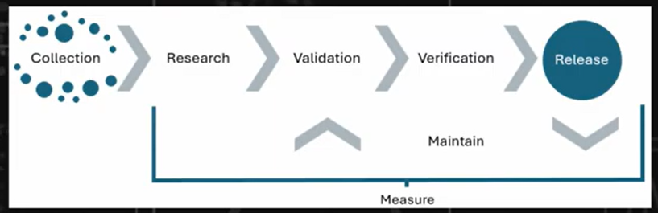

- Hot dogs come in packs of 10 and buns in 8 - it's a paradox.  We have the same problem in detection engineering and alert disposition.  You have to define things clearly between all the involved groups
- What is detection engineering?
    - aligns to secops, but it's focused on designing, building, and fine-tuning systems and processes to detect malicious activities or unauthorized behaviors
- Pod concept
    - Helpful to define a structure for teams
    - You have seniors in each area of responsibility and you can rotate junior people around slowly to get experience in them.  Retain the talent but allow them a bit of freedom.
    - Avoids pigeon holing people into roles
    - Threat intel, hunters, triage, sysadmins, etc.
    - Depends on the size of the organization though
    - if only 2 seniors - rotate people around the two pods (secops and risk management)

# Lifecycle

- 
- Collection
    - Collection of ideas submitted by various members of company (not just data and logs)
    - Analysts, Hunters, Responders, Intel Team, Engineers, Red Team, Stakeholders
    - ISACs too
    - 