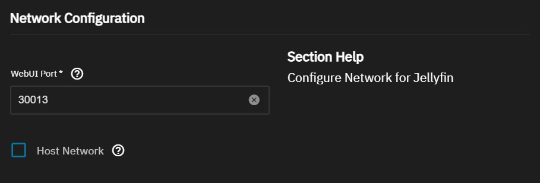
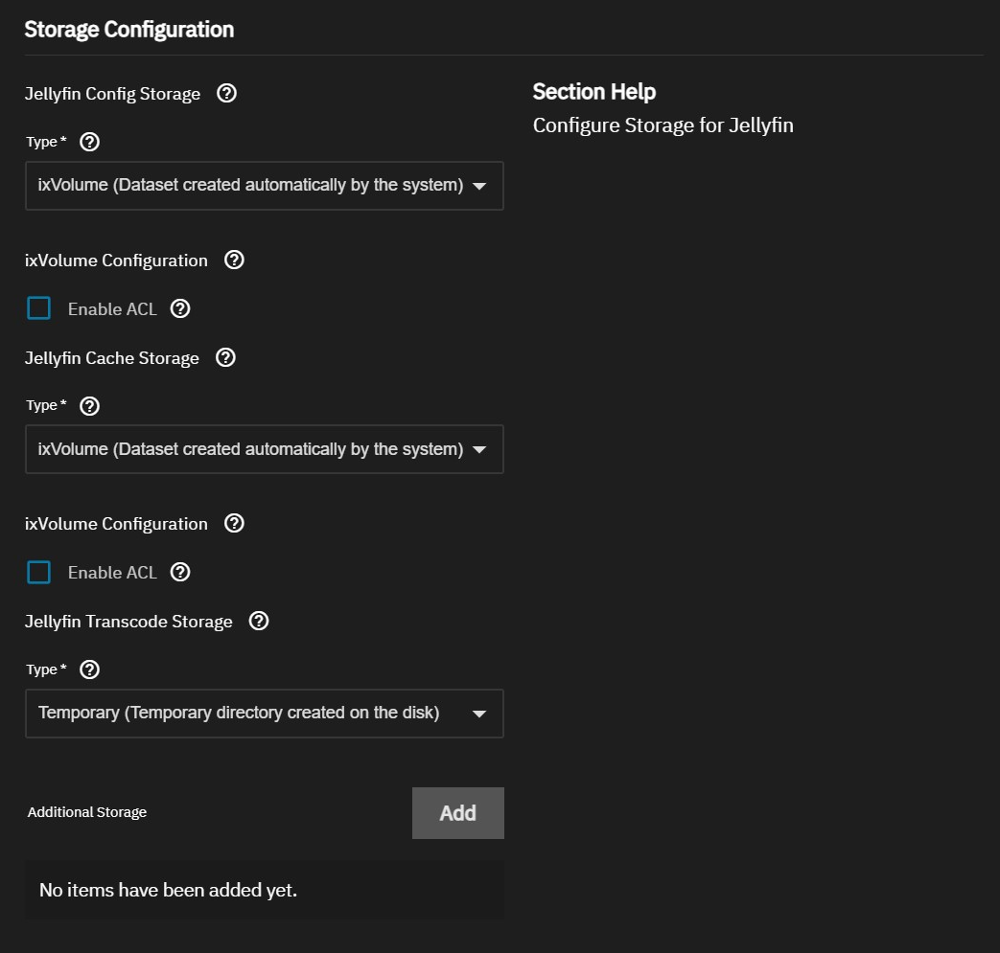
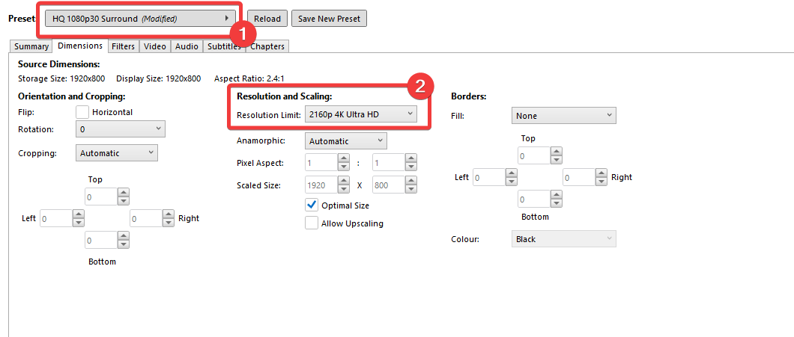

---
title:
permalink:
aliases: []
tags: []
publish: true
date created: Friday, March 29th 2024, 11:03 pm
date modified: Saturday, August 2nd 2025, 2:25 pm
---

# Links

- [handbrake.fr > HandBrake: Open Source Video Transcoder](https://handbrake.fr/)
- [github.com > HaveAGitGat/Tdarr: Tdarr - Distributed transcode automation using FFmpeg/HandBrake + Audio/Video library analytics + video health checking (Windows](https://github.com/HaveAGitGat/Tdarr)
- [github.com > Media Workflow for Jellyfin](https://gist.github.com/Tuetenk0pp/516dce7aa4951e029ee64403191ac6f2)
- [awesome-jellyfin/awesome-jellyfin: A Collection of Awesome Jellyfin Plugins, Themes, Guides and More!](https://github.com/awesome-jellyfin/awesome-jellyfin)
- 
- YouTube
	- [Alternative YouTube Clients](../../../../📁%2003%20-%20Curations,%20Stacks/Alternative%20YouTube%20Clients/Alternative%20YouTube%20Clients.md)
	- [r/youtubedl Wiki: yt-dlp GUI Guide](https://www.reddit.com/r/youtubedl/wiki/info-guis/)
	- [ankenyr/jellyfin-youtube-metadata-plugin: Youtube Metadata Plugin for Jellyfin](https://github.com/ankenyr/jellyfin-youtube-metadata-plugin)
	- [reddit.com > Automatic YouTube Video downloads to Jellyfin](https://www.reddit.com/r/selfhosted/comments/10wy7wl/automatic_youtube_video_downloads_to_jellyfin/)
	- [reddit.com > Is there a way to get jellyfin to automatically download youtibe videos from specific creators?](https://www.reddit.com/r/jellyfin/comments/wdhu36/is_there_a_way_to_get_jellyfin_to_automatically/)
	- [jellyfin.org > Youtube plugin?](https://forum.jellyfin.org/t-youtube-plugin)
	- [github.com > Beheadedstraw/Tubular: Tubular - A YouTube video collecting suite](https://github.com/Beheadedstraw/Tubular)
	- [github.com > AECX/FinTube: Jellyfin Plugin to import directly from YT](https://github.com/AECX/FinTube)
	- [github.com > alexta69/metube: Self-hosted YouTube downloader (web UI for youtube-dl / yt-dlp)](https://github.com/alexta69/metube)
	- [github.com > mendel5/alternative-front-ends: Overview of alternative open source front-ends for popular internet platforms (e.g. YouTube, Twitter, etc.)](https://github.com/mendel5/alternative-front-ends#imgur)
	- 
- [3 Ways to Start Your Own Plex Server - YouTube](https://www.youtube.com/watch?v=XKDSld-CrHU)
- [Important information for users running Plex Media Server on Nvidia Shield devices - Announcements - Plex Forum](https://forums.plex.tv/t/important-information-for-users-running-plex-media-server-on-nvidia-shield-devices/883484 "Important information for users running Plex Media Server on Nvidia Shield devices - Announcements - Plex Forum")
- [Prowlarr](https://prowlarr.com/ "Prowlarr")
- [Clients | Jellyfin](https://jellyfin.org/downloads/clients/?platform=Roku "Clients | Jellyfin")
- [Jellyfin | Open Source Alternative to Plex, Emby, Netflix](https://www.opensourcealternative.to/project/jellyfin "Jellyfin | Open Source Alternative to Plex, Emby, Netflix")
- [Must have Plex addons : r/PleX](https://www.reddit.com/r/PleX/comments/1bwfffx/must_have_plex_addons/ "Must have Plex addons : r/PleX")
- [Open Source Home Theater Software | Kodi](https://kodi.tv/ "Open Source Home Theater Software | Kodi")
- [Plex Pass | Plex](https://www.plex.tv/plex-pass/ "Plex Pass | Plex")
- [Open source alternatives to Emby](https://www.opensourcealternative.to/alternativesto/emby "Open source alternatives to Emby")
- [2 Open Source Alternatives to Plex](https://www.opensourcealternative.to/alternativesto/plex "2 Open Source Alternatives to Plex")
- [Build your own DVR with Plex Server! #plex #homeserver #antenna - YouTube](https://www.youtube.com/watch?v=0HxtccUFtm8)
- [The Ultimate Guide to Configuring Live TV & DVR with Plex! - YouTube](https://www.youtube.com/watch?v=Q5okoyPewyU) 
- [disable this plex setting RIGHT NOW - YouTube](https://www.youtube.com/watch?v=RENjSPXJUdg)
- [The ULTIMATE Budget Jellyfin Server - YouTube](https://www.youtube.com/watch?v=WCDmHljsinY)
- [Time to UNSUBSCRIBE from Disney+, Netflix, etc! - YouTube](https://www.youtube.com/watch?v=RZ8ijmy3qPo)
- [Better than Disney+: Jellyfin on my NAS - YouTube](https://www.youtube.com/watch?v=4VkY1vTpCJY)
- [Piracy Doesn’t Pay - YouTube](https://www.youtube.com/watch?v=SPWiCm5tT7Y)

# Plex Addons

- [Plex and the *ARR stack |](https://sysblob.com/posts/plex/)
- [Servarr | Servarr Wiki](https://wiki.servarr.com/)
- [Prowlarr](https://prowlarr.com/)
- [Must have Plex addons : r/PleX](https://www.reddit.com/r/PleX/comments/1bwfffx/must_have_plex_addons/)
- [Streaming, Plex, and Arr's | RapidSeedbox — Help Desk](https://help.rapidseedbox.com/en/collections/615805-streaming-plex-and-arr-s)
- [Plex | ARR Wiki](https://arr.passthebits.com/en/plex)
- [The Ultimate Plex Software Stack - Arrs and More! : r/PleX](https://www.reddit.com/r/PleX/comments/1arzr1y/the_ultimate_plex_software_stack_arrs_and_more/)
- [Ravencentric/awesome-arr: A collection of *arrs and related stuff.](https://github.com/Ravencentric/awesome-arr)
- [Radarr/Sonarr Settings - Kometa Wiki](https://metamanager.wiki/en/develop/files/arr/)
- [DonMcD/ultimate-plex-stack: This comprehensive Plex stack configuration simplifies the setup for your media server, integrating Plex, Radarr, Sonarr, Prowlarr, and more for seamless movie and TV show streaming with enhanced management and automation features, including VPN support, subtitle management and much more!](https://github.com/DonMcD/ultimate-plex-stack)
- [Overseerr](https://overseerr.dev/)
- 

# Plex vs Jellyfin

- [(19) The open source alternative to my sponsor - Jellyfin vs Plex - YouTube](https://www.youtube.com/watch?v=jKF5GtBIxpM&list=WL&index=98&t=25s)
- 


## Jellyfin

> [!tldr] It's open source and has some privacy and advanced benefits, but it lacks the convenience and sharability that I need for the time being

- [Jellyfin Feature Requests](https://features.jellyfin.org/?view=most-wanted)

- Client Options that I care about:
	- [Clients | Jellyfin](https://jellyfin.org/downloads/clients/all)
	- Android TV
	- Roku
	- Android

## Plex

- Client options:
	- [Best Media Streaming Devices | Live streaming apps powered by Plex](https://www.plex.tv/apps-devices/)
	- Apple TV
	- Fire TV
	- Google TV
	- Roku
	- Smart TVs
	- Android 
	- iOS

- Pros
	- Easy system to share with people
- Current issues:
	- Offline download stinks
	- Some technical privacy issues at times
- Cons
	- Costs money for plex pass for people who want to use your library

# Plex on TrueNAS Scale

- Docs
	- [Plex | TrueNAS Documentation Hub](https://www.truenas.com/docs/truenasapps/stableapps/plexapp/)

## 1) Plex Account

- Sign up with a Plex account - [Plex plex.tv › home › sign up Sign Up | Plex](https://www.plex.tv/sign-up/ "") 

## 1.a) First time in TrueNAS?

Set a pool for applications to use if not already assigned.
- You can use either an existing pool or [create a new one](https://www.truenas.com/docs/scale/scaletutorials/storage/createpoolwizard/). TrueNAS creates the **ix-apps** (hidden) dataset in the pool set as the application pool. This dataset is internally managed, so you cannot use this as the parent when you create required application datasets.

## 2) Create Plex-Related "Datasets" in TrueNAS

- Go to **Datasets** and select the pool or dataset where you want to place the dataset(s) for the app. For example, _/tank/apps/appName_.
    
> [!important] 
> Plex uses 2 main storage volumes: 
> 1) **data** to use as the Plex data directory for database and metadata storage, and 
> 2) **config** for Plex application configuration storage.
>    
> - For **log data**, you should just use a temporary directory. 
> - **Transcode data** is also not useful or meant for persistent storage, so using a temporary directory is a better option.


> [!info]- [Creating Datasets for Apps](https://www.truenas.com/docs/truenasapps/stableapps/plexapp/ "Plex | TrueNAS Documentation Hub")
> 
> When creating datasets for apps follow these steps:
> 
> 1. Go to **Datasets**, select the location for the parent dataset if organizing required datasets under a parent dataset, then click **Add Dataset**. For example, select the root dataset of the pool, and click **Add Dataset** to create a new parent called _apps_ or _appName_*, where _appName_ is the name of the app.
>     
>     Do not create the app datasets under the ix-applications or ix-apps dataset.
>     
> 2. Enter the name of the dataset, then select **Apps** as the **Dataset Preset**. Creating the parent dataset with the preset set to **Generic** causes permissions issues when you try to create the datasets the app requires with the preset set to **Apps**.
>     
> 3. Click **Save**. Return to dataset creation when prompted rather than configuring ACL permissions.
>     
>     You can set up permissions (ACLs) for a dataset after adding it by selecting **Go to ACL Manager** to open the **Edit ACL** screen, or wait and use the app Install wizard ACL settings to add permissions. You can also edit permissions after installing the app using either method.
>     
> 4. Select the parent dataset and then click **Create Dataset** to open the **Add Dataset** screen again.
>     
> 5. Enter the name of a dataset required for the app, such as _config_, select **Apps** as the **Dataset Preset**, and then click **Save**. When prompted, return to creating datasets rather than setting up ACL permissions.
>     
> 6. Repeat for remaining datasets required for the app.
>     
> 
> You can set up the permissions (ACLs) for these datasets after adding them using the **Edit ACL** screen, or wait and use the **Install Plex** wizard ACL settings to add permissions. You can also edit permissions after using either method.

## 3) Installing Plex to TrueNAS

> [!note] You can have multiple deployments of the same app (for example, two or more from the **stable** or **enterprise** trains, or a combination of the **stable** and **enterprise** trains).

Go to **Apps**, click on **Discover Apps**, and locate the app widget by either scrolling down to it or begin typing the name into the search field. 

Select the timezone where your TrueNAS system is located. Begin typing the location into the **Timezone** field to filter the list until the location shows, then select it.

While logged into your Plex account, go to the [Plex **Claim Code** web page](https://www.plex.tv/claim/) to copy the **Claim Code** string provided by Plex, and then paste it into the TrueNAS **Install Plex** wizard **Claim Token** field. This authentication token provides TrueNAS access to your Plex account.

### 3.a) Network Settings & Devices

Next, either accept the default values shown or enter the IP addresses for local network connections (Ethernet or WiFi routers) you want in your Plex network. See [Setting Up Local Network](https://www.truenas.com/docs/truenasapps/stableapps/plexapp/#setting-up-local-network) below for more information.

You can add devices and additional environment variables, but this is not required to deploy the app. For more information, see [Adding Devices](https://www.truenas.com/docs/truenasapps/stableapps/plexapp/#adding-devicess) below.

> [!important]
> The app does not require configuring advanced DNS options. Accept the default settings or click **Add** to the right of **DNS Options** to enter the option name and value.

Click Install!

## 4) Access Plex

- Once deployed, go to the app and click the `Web UI` button to get redirect and attach it
- If that doesn't work, you can add `/manage` to the end of the URL from the app settings for Plex in TrueNAS Apps

## 5) More Plex

- [substack.com > Plex workflow](https://fsconotes.substack.com/p/plex-workflow-the-fs-co-way-2024)
- [plex.tv > Parental Controls](https://support.plex.tv/articles/parental-controls/)
- 

# Jellyfin on TrueNAS Scale

- [github.com > homelab/media/jelly-compose.yaml at main · TechHutTV/homelab](https://github.com/TechHutTV/homelab/blob/main/media/jelly-compose.yaml)
- 

- Docs & Guides
	- [youtube.com > my NEW Proxmox Media Server - Full Walkthrough Guide Pt.2 (Jellyfin](https://www.youtube.com/watch?v=Uzqf0qlcQlo)
	- [github.com > media-stack/README.md at main · navilg/media-stack](https://github.com/navilg/media-stack/blob/main/README.md)
	- [jellyfin.org > TrueNAS SCALE | Jellyfin](https://jellyfin.org/docs/general/installation/truenas/)
	- 

## 1) Create Jellyfin-Related "Datasets" in TrueNAS

- Go to **Datasets** and select the pool or dataset where you want to place the dataset(s) for the app. For example, _/tank/apps/appName_.
    
> [!important] 
> Jellyfin uses 3 main storage volumes.  
> Create a dataset for each.
> 1. cache
> 2. config
> 3. cache/transcodes

> [!info]- [Creating Datasets for Apps](https://www.truenas.com/docs/truenasapps/stableapps/plexapp/ "Plex | TrueNAS Documentation Hub")
> 
> When creating datasets for apps follow these steps:
> 
> 4. Go to **Datasets**, select the location for the parent dataset if organizing required datasets under a parent dataset, then click **Add Dataset**. For example, select the root dataset of the pool, and click **Add Dataset** to create a new parent called _apps_ or _appName_*, where _appName_ is the name of the app.
>     
>     Do not create the app datasets under the ix-applications or ix-apps dataset.
>     
>     
> 5. Enter the name of the dataset, then select **Apps** as the **Dataset Preset**. Creating the parent dataset with the preset set to **Generic** causes permissions issues when you try to create the datasets the app requires with the preset set to **Apps**.
>     
> 6. Click **Save**. Return to dataset creation when prompted rather than configuring ACL permissions.
>     
>     You can set up permissions (ACLs) for a dataset after adding it by selecting **Go to ACL Manager** to open the **Edit ACL** screen, or wait and use the app Install wizard ACL settings to add permissions. You can also edit permissions after installing the app using either method.
>     
> 7. Select the parent dataset and then click **Create Dataset** to open the **Add Dataset** screen again.
>     
> 8. Enter the name of a dataset required for the app, such as _config_, select **Apps** as the **Dataset Preset**, and then click **Save**. When prompted, return to creating datasets rather than setting up ACL permissions.
>     
> 9. Repeat for remaining datasets required for the app.
>     
> 
> You can set up the permissions (ACLs) for these datasets after adding them using the **Edit ACL** screen, or wait and use the **Install Plex** wizard ACL settings to add permissions. You can also edit permissions after using either method.

## 2) Installing Jellyfin to TrueNAS

> [!note] You can have multiple deployments of the same app (for example, two or more from the **stable** or **enterprise** trains, or a combination of the **stable** and **enterprise** trains).

Go to **Apps**, click on **Discover Apps**, and locate the app widget by either scrolling down to it or begin typing the name into the search field. 

Select the timezone where your TrueNAS system is located. Begin typing the location into the **Timezone** field to filter the list until the location shows, then select it.

### 2.a) Published Server URL & Environment Variables

You can accept the defaults in the **Jellyfin Configuration** settings, or enter the settings you want to use.

You can enter a **Published Server URL** for use in UDP autodiscovery, or leave it blank.

If needed, click **Add** to define **Additional Environment Variables**, see [Configuration](https://jellyfin.org/docs/general/administration/configuration/) for options.

### 2.b) Network Settings & Devices

Select **Host Network** under **Network Configuration** if using [DLNA](https://jellyfin.org/docs/general/networking/dlna/), to bind network configuration to the host network settings. Otherwise, leave **Host Network** unselected.



You can accept the default port number in **WebUI Port**, which is **30013**.

You can change this to port **8096**. Most Jellyfin clients have built-in scanning features that look for port **8096** by default.

Refer to the TrueNAS [default port list](https://www.truenas.com/docs/references/defaultports/) for a list of assigned port numbers.

### 2.c) Storage Settings

Jellyfin requires three app storage datasets for:

1. Jellyfin Config Storage
2. Jellyfin Cache Storage
3. Jellyfin Transcodes Storage

Solid state storage is recommended for config, cache, and transcode storage. Do not use datasets located on spinning disks where your media storage/libraries are found for these datasets to avoid slowdowns.

You can install Jellyfin using the default setting **ixVolume (dataset created automatically by the system)** or use the host path option with datasets [created before installing the app](https://jellyfin.org/docs/general/installation/truenas/#datasets--jellyfin).



Select **Host Path (Path that already exists on the system)** to browse to and select the datasets.


For **Jellyfin Transcodes Storage**, in **Type**, select:

- **Host Path (Path that already exists on the system)** to use an existing dataset created on the system
- **ixVolume (dataset created automatically by the system)** to let SCALE create the dataset
- **Temporary (Temporary directory created on the disk)** to use a temporary storage directory created somewhere on the storage pool you set for the Apps system
- **tmpfs (Temporary directory created on the RAM)** to use a temporary storage directory created on the system RAM

It is recommended to link the transcode directory to a location with decent amount of available storage. Transcodes can take up a lot of space depending on the type of content that is being transcoded. If there's not enough storage here, you will run into playback issues when a transcode doesn't have space to continue being written out.

#### Mounting Additional Storage

Click **Add** next to **Additional Storage** to add the media library storage path(s) on your system.


Select **Host Path (Path that already exists on the system)** or **SMB/CIFS Share (Mounts a volume to a SMB share)** in **Type**. You can select **iXvolume (Dataset created automatically by the system)** to create a new library dataset, but this is not recommended.

Mounting an SMB share allows data synchronization between the share and the app. The SMB share mount does not include ACL protections at this time. Permissions are currently limited to the permissions of the user that mounted the share. Alternate data streams (metadata), finder colors tags, previews, resource forks, and MacOS metadata are stripped from the share along with filesystem permissions, but this functionality is undergoing active development and implementation planned for a future TrueNAS SCALE release.

- Note that if you want to take advantage of Jellyfin's built-in feature of **real-time media scanning**, you need to mount your media directly with a **Host Path** as SMB connections do not support this feature.

For all types, enter a **Mount Path** to be used within the Jellyfin container.

- For example, the local **Host Path** /mnt/tank/video/movies could be assigned the **Mount Path** /media/movies.
    - With this example, you would browse to `/media/movies` in Jellyfin to see the contents of `/mnt/tank/video/movies` on your SCALE server.

> [!info]- Additional Storage Fields
> |Type|Field|Description|
> |---|---|---|
> |All|Mount Path|The virtual path to mount the storage within the container.|
> |Host Path|Host Path|The local path to an existing dataset on the System.|
> |ixVolume|Dataset Name|The name for the dataset the system creates.|
> |SMB Share|Server|The server for the SMB share.|
> |SMB Share|Share|The name of the share.|
> |SMB Share|Domain (Optional)|The domain for the SMB share.|
> |SMB Share|Username|The user name used to access the SMB share.|
> |SMB Share|Password|The password for the SMB share user.|
> |SMB Share|Size (in Gi)|The quota size for the share volume. You can edit the size after deploying the application if you need to increase the storage volume capacity for the share.|

### 2.d) Resource Configuration Settings


You can customize limits on the CPU and memory allocated to the container Jellyfin will reside in.

- **CPUs** expects a value in **number of threads** to assign as a max CPU thread limit.
    - You should set this option to the number of threads your CPU contains.
    - [Refer here for reasonable CPU limits based on your SCALE server's CPU](https://jellyfin.org/docs/general/administration/hardware-selection#cpu)
- **Memory (in MB)** expects a value in **megabytes**.
    - The default is **4096** which means the container will be limited to 4GB of RAM usage.
    - To calculate a value in gigabytes, use this formula where **X** is a number in MB: `X * 1024`
    - [Refer here for sensible RAM limits for your Jellyfin server](https://jellyfin.org/docs/general/administration/hardware-selection#system-memory-ram)
- The max limit you can assign to either limit depends on your SCALE server's specs.

For the GPU Configuration, check the **Passthrough available (non-NVIDIA) GPUs** option if you need to pass a GPU device for hardware acceleration use with Jellyfin.

- If you have an NVIDIA GPU, [please read this](https://jellyfin.org/docs/general/installation/truenas/#nvidia-gpus-on-scale-v2410).

### Finalizing Install

Click **Install**.

A container launches with root privileges to apply the correct permissions to the Jellyfin directories. Afterward, the Jellyfin container runs as a non-root user (default: 568). Configured storage directory ownership is changed if the parent directory does not match the configured user.

The system opens the **Installed Applications** screen with the Jellyfin app in the **Deploying** state. When the installation completes, it changes to **Running**.


Click the **Web UI** button on the **Application Info** widget to open the Jellyfin web initial setup wizard to set up your admin account and begin administering libraries.


## 3) Access Jellyfin

- Once deployed, go to the app and click the `Web UI` button to get redirect and attach it
- If that doesn't work, you can add `/manage` to the end of the URL from the app settings for Plex in TrueNAS Apps

## 4) Media Curation Workflow

> [!attention] Yes...this is where we get into a dicey moral grey area

- Workflow Breakdown
	- Buy DVDs
	- Rip with [MakeMKV](../../../../⬇️%20Clippings/Tech/MakeMKV/MakeMKV.md)
	- Transcode with Handbrake
	- Rename with Filebot
	- Drop into Jellyfin folder

- Related videos
	- [youtube.com > Time to UNSUBSCRIBE from Disney+ > Jeff Geerling](https://www.youtube.com/watch?v=RZ8ijmy3qPo)
	- [youtube.com > Media Ripping Explained](https://www.youtube.com/watch?v=GdQ5bClEgHg)
	- [youtube.com > Better than Disney+: Jellyfin on my NAS](https://www.youtube.com/watch?v=4VkY1vTpCJY)
	- 

- Where to buy discs
	- Movie stores - if they still exist around you
	- Amazon

- Organization and renaming
	- [filebot.net > FileBot](https://www.filebot.net/)

- Torrenting workflow
	- [Shakil-Shahadat/awesome-piracy: A curated list of awesome warez and piracy links.](https://github.com/Shakil-Shahadat/awesome-piracy)
	- [servarr.com > Prowlarr](https://wiki.servarr.com/prowlarr)
	- [github.com > Sonarr/Sonarr: Smart PVR for newsgroup and bittorrent users.](https://github.com/Sonarr/Sonarr)
	- [freshrss.org > FreshRSS](https://freshrss.org/index.html)
	- [github.com > media-stack/README.md at main · navilg/media-stack](https://github.com/navilg/media-stack/blob/main/README.md)
	- [medium.com > Self-host media stack (Jellyfin+Radarr+Sonarr+Jackett+Transmission)](https://medium.com/linux-shots/self-host-media-stack-jellyfin-radarr-sonarr-jackett-transmission-3e6a0adf716e)
	- https://github.com/qbittorrent/search-plugins/wiki/Unofficial-search-plugins
	- VPN
		- Use a good VPN
		- [github.com > Chillsmeit/qBittorrent-ProtonVPN-Guide: Guide for setting up qBittorrent with ProtonVPN](https://github.com/Chillsmeit/qBittorrent-ProtonVPN-Guide)
		- 
	- Manually via your own desktop
		- [qbittorrent.org > qBittorrent Official Website](https://www.qbittorrent.org/)
		- [rapidseedbox.com > Best qBittorrent Settings [+ Port Forwarding]](https://www.rapidseedbox.com/blog/qbittorrent-settings#03)
		- [reddit.com > Best settings for qbittorrent?](https://www.reddit.com/r/qBittorrent/comments/96s7v3/best_settings_for_qbittorrent/)
		- 
	- Automated in TrueNAS Scale
		- [truenas.com > Guide: How to install qbittorrent (or any app) with vpn on Truenas Electric Eel - TrueNAS General](https://forums.truenas.com/t/guide-how-to-install-qbittorrent-or-any-app-with-vpn-on-truenas-electric-eel/12677)
		- [truenas.com > TrueNAS Scale and Qbit torrent (CIFS share access) - TrueNAS General](https://forums.truenas.com/t/truenas-scale-and-qbit-torrent-cifs-share-access/6848)
		- [truenas.com > Help: Setting up a VPN client on (TrueNAS-SCALE-23.10.2) for torrenting - TrueNAS General](https://forums.truenas.com/t/help-setting-up-a-vpn-client-on-truenas-scale-23-10-2-for-torrenting/1610)
		- [linustechtips.com > Need help: torrenting with VPN in TrueNAS Scale](https://linustechtips.com/topic/1603061-need-help-torrenting-with-vpn-in-truenas-scale/)
		- [reddit.com > How to setup qBittorrent with a VPN now that TrueCHARTS is dead?](https://www.reddit.com/r/truenas/comments/1e5vgvg/how_to_setup_qbittorrent_with_a_vpn_now_that/)
		- [truenas.com > TrueNAS Scale: Setting up qBitTorrent (including finding the login password) - Apps and Virtualization](https://forums.truenas.com/t/truenas-scale-setting-up-qbittorrent-including-finding-the-login-password/544)
		- [github.com > Chillsmeit/qBittorrent-ProtonVPN-Guide: Guide for setting up qBittorrent with ProtonVPN](https://github.com/Chillsmeit/qBittorrent-ProtonVPN-Guide)

- Automating YouTube
	- [reddit.com > Automatic YouTube Video downloads to Jellyfin](https://www.reddit.com/r/selfhosted/comments/10wy7wl/automatic_youtube_video_downloads_to_jellyfin/)
	- [reddit.com > Is there a way to get jellyfin to automatically download youtibe videos from specific creators?](https://www.reddit.com/r/jellyfin/comments/wdhu36/is_there_a_way_to_get_jellyfin_to_automatically/)
	- 

- Avoiding Piracy
	- You have 2 options that are somewhat more "legitimate"
		- Ripping discs
		- Record live TV
			- [youtube.com > Build your own DVR with Plex Server!  #plex #homeserver #antenna](https://www.youtube.com/watch?app=desktop&v=0HxtccUFtm8)

- Jellyfin plugins
	- [youtube.com > ULTIMATE Jellyfin Media Server Guide - Plugins and Themes! (PART 3)](https://www.youtube.com/watch?v=DivZcyoY6bs)
	- [youtube.com > Must-Have Jellyfin Plug-ins For Your Media Center](https://www.youtube.com/watch?v=iHTah6KpxXs)
	- [github.com > danieladov/jellyfin-plugin-skin-manager: Jellyfin Skin Manager is a plugin that helps you to download and install skins](https://github.com/danieladov/jellyfin-plugin-skin-manager)
	- [github.com > CTalvio/Ultrachromic: The final form, the true evolution of the chromic theme saga!](https://github.com/CTalvio/Ultrachromic)
	- 

- Ripping discs
	- [makemkv.com > Ultimate UHD Drives Flashing Guide Updated 2025 - www.makemkv.com](https://forum.makemkv.com/forum/viewtopic.php?f=16&t=19634)
		- [makemkv.com > MakeMKV is free while in beta - www.makemkv.com](https://forum.makemkv.com/forum/viewtopic.php?t=1053)
	- [youtube.com > Time to UNSUBSCRIBE from Disney+ > Jeff Geerling](https://www.youtube.com/watch?v=RZ8ijmy3qPo)
	- [youtube.com > Media Ripping Explained](https://www.youtube.com/watch?v=GdQ5bClEgHg)
	- [youtube.com > This Saved Me SO Much Time – Ripping Movies Automatically With ARM](https://www.youtube.com/watch?v=wPWx6GISIhY)
	- [b3n.org > Automatic Ripping Machine | Headless | Blu-Ray/DVD/CD](https://b3n.org/automatic-ripping-machine/)
	- [youtube.com > How To Rip DVDs With MakeMKV and Use Handbrake For Hardware Transcoding](https://www.youtube.com/watch?v=u_xdrscVB0Y)
	- [makemkv.com > Options for trying to back up scratched discs? - www.makemkv.com](https://forum.makemkv.com/forum/viewtopic.php?t=15195)
	- [youtube.com > How to Rip 4K & Blu-Ray Movies | The Official Guide](https://www.youtube.com/watch?v=LguN8RCXVyc)
	- [youtube.com > Streaming 4K Blu-rays With a DECADE-OLD PC](https://www.youtube.com/watch?v=jZRQh-ngoO4)
	- 
	- Required tools
		- [handbrake.fr > HandBrake: Open Source Video Transcoder](https://handbrake.fr/)
		- [makemkv.com > MakeMKV - Make MKV from Blu-ray and DVD](https://www.makemkv.com/)
		- VLC
			- [makemkv.com > MakeMKV is free while in beta - www.makemkv.com](https://forum.makemkv.com/forum/viewtopic.php?t=1053)
		- [archive.org > SDFtool Flasher (v 1.3.4) : MartyMcNuts : Free Download, Borrow, and Streaming : Internet Archive](https://archive.org/details/sdftool-flasher-v-1.3.4)
			- [makemkv.com > SDFtool Flasher - www.makemkv.com](https://forum.makemkv.com/forum/viewtopic.php?t=22896) - guide for flashing drive
			- 
	- [Amazon.com: Pioneer Electronics BDR-XS07UHD 6x Slot Loading CD DVD BluRay Portable USB 3.1 BD/DVD/CD Burner Supports Blu-Ray](https://www.amazon.com/Pioneer-Electronics-BDR-XS07UHD-Portable-Supports/dp/B00FGVPTHW) - $174.99

### 1) Filebot Prep for Handbrake

Movies expression format:

```json
D:/MEDIA/_BATCH_2TRANSCODE_HANDBRAKE/Movies/{n} ({y}){m=fn.matchAll(/extended|uncensored|uncut|directors[ ._-]cut|remastered|unrated|special[ ._-]edition/)*.upperInitial()*.lowerTrail().sort().join(', ').replaceAll(/[.]/,' '); m?' ('+m+')':''}{' {imdb-'+imdbid+'}'}{audioLanguages.size()>2?' (Multi Audio)':audioLanguages.size()>1?' (Dual Audio)':!audioLanguages =~ /eng/?' ('+audioLanguages.ISO3.join(', ').upper()+')':''} [{vf} {vc} {ac} {af}]{edition?' {'+edition+'}':''}{' -cd'+pi}{dc>1?' -cd'+di:''}
```

TV Shows expression format:

```json
D:/MEDIA/_BATCH_2TRANSCODE_HANDBRAKE/TV Shows/{n} - {s00e00} - {t} ({y}) {'{tmdb-'+tmdbid+'}'}{audioLanguages.size()>2?' (Multi Audio)':audioLanguages.size()>1?' (Dual Audio)':!audioLanguages =~ /eng/?' ('+audioLanguages.ISO3.join(', ').upper()+')':''} [{vf} {vc} {ac} {af}]{' -cd'+pi}{dc>1?' -cd'+di:''}
```

### 2) Handbrake

- batch scan and put all your stuff into a queue

#### Handbrake Settings

- For now, H.264 for the video encoding since most things still don't support H.265
- For subtitles, make sure to go to Subtitles > Selection Behavior, move (Any) to `Selected Languages`, and leave Burn-in set to None.
- Use `H.264 (NVEnc)` if you want to speed up the process using an NVIDIA GPU
	- [medium.com > Nvidia enconding options in Handbrake](https://medium.com/@reyes83/nvidia-enconding-options-in-handbrake-d659e08627fc)

##### Configuration 1: HQ 1080p30 Surround w/2160p Resolution Limit

- Blu-ray and High-Definition Content
- 

##### Configuration 2: HQ 1080p30 Surround w/1080p Resolution Limit

- Literally choose `HQ 1080p30 Surround` and leave everything the same

### 3) Filebot Settings to Prepare for Jellyfin

- [filebot.net > [MakeMKV] title_t00.mkv, title_t01.mkv, etc - FileBot](https://www.filebot.net/forums/viewtopic.php?t=10904)
- [filebot.net > Plex / Kodi / Emby / Jellyfin Naming Schemes - FileBot](https://www.filebot.net/forums/viewtopic.php?t=4116)
- [filebot.net > Format Expressions](https://www.filebot.net/naming.html)
- [filebot.net > How about sharing our format expressions? - FileBot](https://www.filebot.net/forums/viewtopic.php?t=2)
- [youtube.com > Streamline Plex TV Show Naming with FileBot](https://www.youtube.com/watch?v=PRdNYG2ArJo)
- [youtube.com > Rename TV Series](https://www.youtube.com/watch?v=uD4WQN_vWcE)
- [youtube.com > Automatic Subtitle Lookup](https://www.youtube.com/watch?v=q-oZ_hovsTY)
- [opensubtitles.org > Subtitles - download movie and TV Series subtitles](https://www.opensubtitles.org/en/index.asp)
- [filebot.net > Metadata and Extended Attributes - FileBot](https://www.filebot.net/forums/viewtopic.php?f=3&t=324)
- [filebot.net > Rename from file hash - FileBot](https://www.filebot.net/forums/viewtopic.php?t=2984) - not as good as you might think - harder to do or automate
- [filebot.net > Advanced Settings / Developer Options / System Properties - FileBot](https://www.filebot.net/forums/viewtopic.php?t=3913)

<u>V1:</u>

Movies:
```json
D:/MEDIA/_BATCH_4OUTPUT_FOR_JELLYFIN/Movies/{collection+'/'} {n} ({y}) {' (' + fn.matchAll(/extended|uncensored|uncut|directors[ ._-]cut|remastered|unrated|special[ ._-]edition/)*.upperInitial()*.lowerTrail().sort().join(', ').replaceAll(/[.]/, " ") + ')'} {"{imdb-$imdbid}"} {audioLanguages.size() > 2 ? ' (Multi Audio)' : audioLanguages.size() > 1 ? ' (Dual Audio)' : audioLanguages =~ /eng/ ? null : audioLanguages.ISO3.joining(', ', ' (', ')').upper()} / {n} ({y}) {"[$vf $vc $ac $af]"}{" {edition-${tags.first()}}"}{subt}{pi != null ? ' -cd'+pi : dc>1 ? ' -cd'+di : ''}
```

TV Shows:
```json
D:/MEDIA/_BATCH_4OUTPUT_FOR_JELLYFIN/TV Shows/{n} ({y}) {"{tmdb-$tmdbid}"} {audioLanguages.size() > 2 ? ' (Multi Audio)' : audioLanguages.size() > 1 ? ' (Dual Audio)' : audioLanguages =~ /eng/ ? null : audioLanguages.ISO3.joining(', ', ' (', ')').upper()} / Season {s}/{s00E00} - {t} {"[$vf $vc $ac $af]"}{subt}{pi != null ? ' -cd'+pi : dc>1 ? ' -cd'+di : ''}
```

<u>V2:</u>

Movies:

```json
D:/MEDIA/_BATCH_4OUTPUT_FOR_JELLYFIN/Movies/{collection+'/'}{n} ({y}){m=fn.matchAll(/extended|uncensored|uncut|directors[ ._-]cut|remastered|unrated|special[ ._-]edition/)*.upperInitial()*.lowerTrail().sort().join(', ').replaceAll(/[.]/,' ');m?' ('+m+')':''}{' {imdb-'+imdbid+'}'}{audioLanguages.size()>2?' (Multi Audio)':audioLanguages.size()>1?' (Dual Audio)':!audioLanguages =~ /eng/?' ('+audioLanguages.ISO3.join(', ', ', ').upper()+')':''}/{n} ({y}){m=fn.matchAll(/extended|uncensored|uncut|directors[ ._-]cut|remastered|unrated|special[ ._-]edition/)*.upperInitial()*.lowerTrail().sort().join(', ').replaceAll(/[.]/,' ');m?' ('+m+')':''}{' {imdb-'+imdbid+'}'}{' ['+vf+' '+vc+' '+ac+' '+af+']'}{edition?' {'+edition+'}':''}{' -cd'+pi}{dc>1?' -cd'+di:''}
```

TV Shows:

```json
D:/MEDIA/_BATCH_4OUTPUT_FOR_JELLYFIN/TV Shows/{n} ({y}){' {tmdb-'+tmdbid+'}'}{audioLanguages.size()>2?' (Multi Audio)':audioLanguages.size()>1?' (Dual Audio)':!audioLanguages =~ /eng/?' ('+audioLanguages.ISO3.join(', ', ', ').upper()+')':''}/Season {s}/{s00e00} - {t}{' ['+vf+' '+vc+' '+ac+' '+af+']'}{' -cd'+pi}{dc>1?' -cd'+di:''}
```

#### <u>V3:</u>

- https://www.filebot.net/forums/viewtopic.php?t=2
- https://jellyfin.org/docs/general/server/media/movies/#multiple-versions
- https://jellyfin.org/docs/general/server/media/shows

##### 🔧 Reusable components (copy-paste snippets)

**A. Trailing bracketed tag from the source name (optional)**

```json
{ bt = fn.match(/(?i)(?:\[[^\]]+\]|\([^\)]+\))$/); bt ? ' '+bt : '' }
```

B. Language label (Multi / Dual / ISO3 for non-ENG)

```json
{ audioLanguages.size()>2 ? ' (Multi Audio)' 
  : audioLanguages.size()>1 ? ' (Dual Audio)' 
  : !audioLanguages =~ /eng/ ? ' ('+audioLanguages.ISO3.join(', ').upper()+')' : '' }
```

C. Edition keywords (your original “m=” scan)

```json
{ m = fn.matchAll(/extended|uncensored|uncut|directors[ ._-]cut|remastered|unrated|special[ ._-]edition/)
      *.upperInitial()*.lowerTrail().sort().join(', ').replaceAll(/[.]/,' ');
  m ? ' ('+m+')' : '' }
```

**D. Tech blocks (pick one):**

- **Duration variant** (granular uniqueness):

```json
{ ' ['+vf+' '+vc+' '+ac+' '+af+' '+duration+']' }
```

- **CRC variant** (stable uniqueness):

```json
{ ' ['+vf+' '+vc+' '+ac+' '+af+' '+crc32+']' }
```

- Resolution variant:

```json
{ ' ['+resolution+'p '+vc+' '+ac+' '+af+' '+duration+']' }
```

**E. Part / duplicate suffixes**

- **Prefer parts → fall back to duplicates**

```json
{ pc>1 ? ' -cd'+pi : (dc>1 ? ' -dup'+di : '') }
```

- Duplicates only

```json
{ dc>1 ? ' -dup'+di : '' }
```

Notes: `duration` gives ISO-8601 (e.g., `PT1H43M21S`), which Jellyfin ignores but is great for uniqueness. `{crc32}` is shorter if you prefer that. Jellyfin multiple versions require filenames like `Movie (Year) [id] - Label.ext`; the part **before** the `-` must match exactly. “Stacking” (cd1/cd2) cannot be combined with versions

##### Full Format Expressions

###### BATCH 2

Movies:

```json
D:/MEDIA/_BATCH_2TRANSCODE_HANDBRAKE/Movies/{n} ({y}) {' [imdbid-'+imdbid+']'}{ m = fn.matchAll(/extended|uncensored|uncut|directors[ ._-]cut|remastered|unrated|special[ ._-]edition/)*.upperInitial()*.lowerTrail().sort().join(', ').replaceAll(/[.]/,' '); m ? ' ('+m+')' : '' }{ audioLanguages.size()>2 ? ' (Multi Audio)' : audioLanguages.size()>1 ? ' (Dual Audio)' : !audioLanguages =~ /eng/ ? ' ('+audioLanguages.ISO3.join(', ').upper()+')' : '' }{ ' ['+height+'p '+vc+' '+ac+' '+af+' '+duration+']'}{ bt = fn.match(/(?:\[(?!\d[^\]]*Ch\])[^\]]+\]|\([^\)]+\))$/); bt ? ' '+bt : '' }{ pc>1 ? ' -cd'+pi : '' }
```

TV Shows (use duration)
```json
D:/MEDIA/_BATCH_2TRANSCODE_HANDBRAKE/TV Shows/{n} - {s00e00} - {t} ({y}) {' [tmdbid-'+tmdbid+']'}{ audioLanguages.size()>2 ? ' (Multi Audio)' : audioLanguages.size()>1 ? ' (Dual Audio)' : !audioLanguages =~ /eng/ ? ' ('+audioLanguages.ISO3.join(', ').upper()+')' : '' }{ ' ['+height+'p '+vc+' '+ac+' '+af+' '+duration+']'}{ bt = fn.match(/(?:\[(?!\d[^\]]*Ch\])[^\]]+\]|\([^\)]+\))$/); bt ? ' '+bt : '' }{ pc>1 ? ' -cd'+pi : '' }
```

###### BATCH 4

Movies:

```json
D:/MEDIA/_BATCH_4OUTPUT_FOR_JELLYFIN/Movies/{collection+'/'}{n} ({y}) {'[imdbid-'+imdbid+']'}/{n} ({y}) {'[imdbid-'+imdbid+']'} - { m = fn.matchAll(/extended|uncensored|uncut|directors[ ._-]cut|remastered|unrated|special[ ._-]edition/)*.upperInitial()*.lowerTrail().sort().join(', ').replaceAll(/[.]/,' '); m ? ' ('+m+')' : '' }{ audioLanguages.size()>2 ? ' (Multi Audio)' : audioLanguages.size()>1 ? ' (Dual Audio)' : !audioLanguages =~ /eng/ ? ' ('+audioLanguages.ISO3.join(', ').upper()+')' : '' }{ ' ['+height+'p '+vc+' '+ac+' '+af+' '+seconds+'s'+']'}{ bt = fn.match(/(?:\[(?!\d[^\]]*Ch\])[^\]]+\]|\([^\)]+\))$/); bt ? ' - '+bt : '' }
```

- CRC32 variation

```json
D:/MEDIA/_BATCH_4OUTPUT_FOR_JELLYFIN/Movies/{collection+'/'}{n} ({y}) {'[imdbid-'+imdbid+']'}/{n} ({y}) {'[imdbid-'+imdbid+']'} - { m = fn.matchAll(/extended|uncensored|uncut|directors[ ._-]cut|remastered|unrated|special[ ._-]edition/)*.upperInitial()*.lowerTrail().sort().join(', ').replaceAll(/[.]/,' '); m ? ' ('+m+')' : '' }{ audioLanguages.size()>2 ? ' (Multi Audio)' : audioLanguages.size()>1 ? ' (Dual Audio)' : !audioLanguages =~ /eng/ ? ' ('+audioLanguages.ISO3.join(', ').upper()+')' : '' }{ ' ['+height+'p '+vc+' '+ac+' '+af+' '+crc32+' '+seconds+'s'+']'}{ bt = fn.match(/(?:\[(?!\d[^\]]*Ch\])[^\]]+\]|\([^\)]+\))$/); bt ? ' - '+bt : '' }
```

- Duration variation

```json
D:/MEDIA/_BATCH_4OUTPUT_FOR_JELLYFIN/Movies/{collection+'/'}{n} ({y}) {'[imdbid-'+imdbid+']'}/{n} ({y}) {'[imdbid-'+imdbid+']'} - { m = fn.matchAll(/extended|uncensored|uncut|directors[ ._-]cut|remastered|unrated|special[ ._-]edition/)*.upperInitial()*.lowerTrail().sort().join(', ').replaceAll(/[.]/,' '); m ? ' ('+m+')' : '' }{ audioLanguages.size()>2 ? ' (Multi Audio)' : audioLanguages.size()>1 ? ' (Dual Audio)' : !audioLanguages =~ /eng/ ? ' ('+audioLanguages.ISO3.join(', ').upper()+')' : '' }{ ' ['+height+'p '+vc+' '+ac+' '+af+' '+duration+']'}{ bt = fn.match(/(?:\[(?!\d[^\]]*Ch\])[^\]]+\]|\([^\)]+\))$/); bt ? ' - '+bt : '' }
```

TV Shows:

```json
D:/MEDIA/_BATCH_4OUTPUT_FOR_JELLYFIN/TV Shows/{n} ({y}) {'[tmdbid-'+tmdbid+']'}/Season {s}/{s00e00} - {t} - { m = fn.matchAll(/extended|uncensored|uncut|directors[ ._-]cut|remastered|unrated|special[ ._-]edition/)*.upperInitial()*.lowerTrail().sort().join(', ').replaceAll(/[.]/,' '); m ? ' ('+m+')' : '' }{ audioLanguages.size()>2 ? ' (Multi Audio)' : audioLanguages.size()>1 ? ' (Dual Audio)' : !audioLanguages =~ /eng/ ? ' ('+audioLanguages.ISO3.join(', ').upper()+')' : '' }{ ' ['+height+'p '+vc+' '+ac+' '+af+' '+seconds+'s'+']'}{ bt = fn.match(/(?:\[(?!\d[^\]]*Ch\])[^\]]+\]|\([^\)]+\))$/); bt ? ' - '+bt : '' }
```

- Duration variation

```json
D:/MEDIA/_BATCH_4OUTPUT_FOR_JELLYFIN/TV Shows/{n} ({y}) {'[tmdbid-'+tmdbid+']'}/Season {s}/{s00e00} - {t} - { m = fn.matchAll(/extended|uncensored|uncut|directors[ ._-]cut|remastered|unrated|special[ ._-]edition/)*.upperInitial()*.lowerTrail().sort().join(', ').replaceAll(/[.]/,' '); m ? ' ('+m+')' : '' }{ audioLanguages.size()>2 ? ' (Multi Audio)' : audioLanguages.size()>1 ? ' (Dual Audio)' : !audioLanguages =~ /eng/ ? ' ('+audioLanguages.ISO3.join(', ').upper()+')' : '' }{ ' ['+height+'p '+vc+' '+ac+' '+af+' '+duration+']'}{ bt = fn.match(/(?:\[(?!\d[^\]]*Ch\])[^\]]+\]|\([^\)]+\))$/); bt ? ' - '+bt : '' }
```

#### Common Filebot Issues

- Invalid Characters - just click "validate"

### 4) Power Rename for Specials Renaming and Other Cases

- Uses PowerRename for Microsoft PowerToys along with regex for additional name transformations

### +) Music, Books, and More

- [f-droid.org > Subtracks | F-Droid - Free and Open Source Android App Repository](https://f-droid.org/en/packages/com.subtracks/)
- [navidrome.org > Navidrome](https://www.navidrome.org/)
- [lidarr.audio > Lidarr](https://lidarr.audio/)
- [github.com > snuffyDev/Beatbump: Alternative YouTube Music frontend built with Svelte/SvelteKit 🎧](https://github.com/snuffyDev/Beatbump)

> I do not **condone or encourage** downloading, sharing, seeding, or peering of **copyrighted material**.  
> Such activities are **illegal** under international laws.
> 
> This project is intended for **educational purposes only**.

## 5) Transcoding Acceleration w/GPU

- You can run `lspci | grep -i vga` in the TrueNAS Scale Shell to see if it has a GPU and what kind.
	- I had Intel which used Quicksync
- Enable GPU passthrough on the Jellyfin app (bottom of the settings for the app)
- Jellyfin > Admin > Playback > Transcoding > Hardware acceleration
	- Select the applicable type of acceleration

## 6) Networking and NPM (Nginx Proxy Manager)

- Got my DNS set up
- Made entries in Nginx proxy manager and used some additional settings outlined in the below link
	- [jellyfin.org > Nginx | Jellyfin](https://jellyfin.org/docs/general/networking/nginx/)
- Had to use HTTP with nginx proxy manager

## 7) Custom Plugins

- [jellyfin.org > Plugins | Jellyfin](https://jellyfin.org/docs/general/server/plugins/)
- [github.com > awesome-jellyfin/awesome-jellyfin: A Collection of Awesome Jellyfin Plugins](https://github.com/awesome-jellyfin/awesome-jellyfin)

- Go to Plugins > Catalog
- Install

- Installing ones not in the catalog
	- Click the ⚙️ (gear) button next to "Catalog"
	- Click the "+" next to "Repositories"
	- Look through a plugins list and find the `manifest.json` link
	- Copy it
	- Past for the repo link in Jellyfin
	- Add it

## 8) Renaming Shows

- Install the "AniDB", TvDB, and other DB plugins to Jellyfin
	- [Custom Plugins (above)](📁%2007%20-%20Cybersader%20Arsenal/Home%20Lab,%20Home%20Server/TrueNAS%20Scale%20Home%20Server/My%20Media%20Server/My%20Media%20Server.md#7%20Custom%20Plugins)
- Using naming schemes from FileBot
	- [filebot.net > Plex / Kodi / Emby / Jellyfin Naming Schemes - FileBot](https://www.filebot.net/forums/viewtopic.php?t=4116#jellyfin)
		- `{ jellyfin.id }`
	- [filebot.net > Format Expressions](https://www.filebot.net/naming.html)
		- Right click the file names to changes the format expression
- Jellyfin Special Naming
	- [jellyfin.org > Movies | Jellyfin](https://jellyfin.org/docs/general/server/media/movies#naming)
	- [jellyfin.org > TV Shows | Jellyfin](https://jellyfin.org/docs/general/server/media/shows#naming)
- Finding episodes by subtitles or file hash
	- [opensubtitles.com > opensubtitles.com](https://www.opensubtitles.com/en/stats/) - some have said you can use this for file hash-based matching in FileBot, but it may be an older version
	- 

## 9) Testing "arr" Locally

- Download Radarr or Sonarr for something like Windows
	- https://wiki.servarr.com/radarr/installation/windows
	- https://wiki.servarr.com/sonarr/installation/windows
- Test it locally
- Check the option to not start automatically
- In your qbittorrent client:
	- Go to **Tools > Options > Web UI**.
	- Enable the Web UI by checking **"Enable Web User Interface (Remote control)"**.
	- Set a port (default is 8080) and create a username and password for authentication.
	- You could do Bypass authentication for clients on localhost if you want
- To be safe
	- make sure they don't autorun off VPN
	- use Portmaster or another app firewall to block connections or limit them
- You can hook up Radarr and Sonarr to Prowlarr via their API keys into the "Apps" settings for Prowlarr
- Change the renaming based on trash guides recommendations
	- https://trash-guides.info/Radarr/Radarr-recommended-naming-scheme/#optional-jellyfin
- Sync app indexers to sync Prowlarr to the other apps

## 10) Using RSS Feeds

- You can do this from your bittorrent client
- Put the RSS feed URL in and it will allow you to add things as they come

## 11) Fixing Audio, Quiet Audio (Jellyfin, Handbrake)

- [jellyfin.org > Stereo Downmix | Jellyfin](https://jellyfin.org/docs/general/post-install/transcoding/downmix/?utm_source=chatgpt.com)
- [jellyfin.org > Volume Normalization](https://forum.jellyfin.org/t-volume-normalization)
- [jellyfin.org > the sound is very soft](https://forum.jellyfin.org/t-the-sound-is-very-soft)
- [handbrake.fr > HandBrake Documentation — Surround Sound Guide](https://handbrake.fr/docs/en/1.3.0/advanced/surround-sound.html)
- [reddit.com > Force transcoding?](https://www.reddit.com/r/jellyfin/comments/u9aopx/force_transcoding/)

## Quick summary

_Check Jellyfin’s session overlay or server dashboard; if you see “Transcode (Audio)” the server is altering your track._ In HandBrake, set **one surround-compatible passthrough track** plus **one stereo track with modest Dynamic Range Compression (≈ 1.5) and +3 dB Gain**. DRC tames the loud/quiet swings; Gain lifts the entire mix. Saving these rules in **Audio → Selection Behaviour** applies them to every title—TV or film—without extra presets.

### 1 How to know if Jellyfin is transcoding audio

| Where to look | What you’ll see | Notes |
| --- | --- | --- |
| **Server Dashboard → Activity** | Each active stream shows “Direct Play / Direct Stream / Transcode (Audio)” | If it says Transcode, Jellyfin is decoding and re-encoding that track. [forum.jellyfin.org](https://forum.jellyfin.org/t-movies-cropped-when-playing-on-android-tv?utm_source=chatgpt.com) |
| **Playback stats overlay** (Android TV, Jellyfin for Android v0.15+) | Ctrl + D (keyboard) or Info × 2 on remote opens an OSD with codec/bitrate and “Playback Mode” | Handy on TVs and shields. [features.jellyfin.org](https://features.jellyfin.org/posts/3175/advanced-playback-statistics-overlay-in-android-tv-jellyfin-client?utm_source=chatgpt.com) |
| **User settings** → _Profile → Playback_ | “Allow audio playback that requires transcoding” toggle | Disabling this forces Jellyfin to refuse incompatible tracks. [forum.jellyfin.org](https://forum.jellyfin.org/t-allow-audio-playback-that-requires-transcoding?utm_source=chatgpt.com) |

If you always see **Direct Play**, your HandBrake defaults are already compatible and Jellyfin is doing nothing to the audio.

### 2 DRC vs Gain in HandBrake—what’s the difference?

| Feature | What it does | Typical range | When it applies |
| --- | --- | --- | --- |
| **Dynamic Range Compression (DRC)** | Dynamically narrows the gap between the softest and loudest parts (e.g., boosts whispers, leaves explosions) using the Dolby metadata in AC-3/E-AC-3 sources. | **1.0 – 2.5**; HandBrake docs call this the “sweet spot” (0 = off). [handbrake.fr](https://handbrake.fr/docs/en/latest/technical/audio-drc.html?utm_source=chatgpt.com)[handbrake.fr](https://handbrake.fr/docs/en/1.5.0/technical/dynamic-range-compression.html?utm_source=chatgpt.com) | Only while **mixing or re-encoding AC-3/E-AC-3**. No effect on DTS, TrueHD, PCM, etc. |
| **Gain** | Adds a _fixed_ volume boost to the whole track before encoding. | 0 – +6 dB recommended; higher may clip. [handbrake.fr](https://handbrake.fr/docs/en/latest/technical/audio-gain.html?utm_source=chatgpt.com) | Works on any codec or mix-down. |

**Why use both?**  
_DRC 1.5_ makes dialogue easier to hear without crushing dynamics, and a small _+3 dB Gain_ offsets the 4–6 dB you lose when folding the centre channel into stereo. They complement each other and stay well below clipping. [reddit.com](https://www.reddit.com/r/handbrake/comments/mmi9ir/anyone_using_drc_dynamic_range_compression/?utm_source=chatgpt.com)

### 3 “Single-preset” HandBrake audio defaults

Open **Preferences → Audio → Defaults** (your last screenshot) and configure:

| Setting | Recommended value | Rationale |
| --- | --- | --- |
| **Track Selection Behaviour** | _All matching selected languages_ | Keeps commentary/trailer tracks out, but preserves multi-lang episodes. [handbrake.fr](https://handbrake.fr/docs/en/latest/advanced/audio-subtitle-defaults.html?utm_source=chatgpt.com)[handbrake.fr](https://handbrake.fr/docs/en/1.3.0/advanced/audio-subtitle-defaults.html?utm_source=chatgpt.com) |
| **Selected languages** | e.g. _English, Japanese_ (plus “Any” for extras) | Matches your library’s needs. |
| **Audio Encoder rows** | **Row 1 – Stereo:** _Codec = AAC_, _Bitrate = 160 kb/s_, _Mix-down = Stereo_, _DRC = 1.5_, **Gain = +3 dB**  
**Row 2 – Surround:** _Codec = AC-3 Passthru_ (or _AC-3 640 kb/s_ if the source is DTS/TrueHD) | Leaves a proper surround track for sound-bars/AVRs; provides a speech-friendly stereo track for phones, tablets, older TVs. [reddit.com](https://www.reddit.com/r/handbrake/comments/mmi9ir/anyone_using_drc_dynamic_range_compression/?utm_source=chatgpt.com) |
| **Auto Passthru allow list** | ✓ AAC, ✓ AC-3 | Everything else re-encodes to match Row 1/2. |
| **Sample rate** | Auto | HandBrake picks the original rate. |

Save the window and HandBrake will apply these two tracks to **every movie or episode** you scan—no need for separate “TV” vs “Movie” presets unless you want lower stereo bit-rates (e.g., 128 kb/s) for cartoons or sitcoms.

### 4 Jellyfin down-mix tweaks that fit this preset

1. **Stereo Downmix Algorithm:**  
    _Dave750_ keeps LFE rumble; _NightmodeDialogue_ pushes everything to the centre—choose the one you prefer. [jellyfin.org](https://jellyfin.org/docs/general/post-install/transcoding/downmix/?utm_source=chatgpt.com)
    
2. **Audio boost when downmixing:**  
    Leave at **2.0** for Dave750, **1.5–2.0** for NightmodeDialogue, as those algorithms output slightly different baselines. [jellyfin.org](https://jellyfin.org/docs/general/post-install/transcoding/downmix/?utm_source=chatgpt.com)
    
3. **Client fallback:**  
    If a device supports only stereo and Jellyfin must transcode, the server will apply the above boost. Otherwise it will direct-play your HandBrake stereo track.
    

### 5 When would you create a second preset?

| Need | Small tweak |
| --- | --- |
| **Ultra-portable TV episodes** where bandwidth is tight | Drop stereo bitrate to 128 kb/s and leave everything else. |
| **Archival Blu-ray rips with Atmos / DTS-HD MA** | Keep the lossless track as _E-AC-3 7.1 768 kb/s_ (or TrueHD passthrough) plus the same AAC stereo. |

But for 90 % of libraries, the single defaults above keep file sizes reasonable, play everywhere, and deliver consistent loudness.

#### Bottom line

_Use one HandBrake audio-defaults profile: AC-3 5.1 passthrough + AAC stereo (DRC 1.5, Gain +3 dB)._ Jellyfin will direct-play in most cases; when it must down-mix, its “Audio boost when down-mixing” fills the gap. Check the server dashboard to verify; if you don’t see “Transcode (Audio)”, you’re good.

# Media File Stack on TrueNAS Scale

## Gluetun

- [github.com > gluetun-wiki/setup/readme.md at main · qdm12/gluetun-wiki](https://github.com/qdm12/gluetun-wiki/blob/main/setup/readme.md#setup)
- [roadtohomelab.blog > Dead simple container VPN: Gluetun, Portainer, and Private Internet Access](https://roadtohomelab.blog/container-vpn/)
- [reddit.com > Gluetun and qBittorrent correct setup in docker-compose file](https://www.reddit.com/r/selfhosted/comments/15oe631/gluetun_and_qbittorrent_correct_setup_in/)
- 

## Custom APP Docker Compose YAML, Apps, Datasets, etc.

```yaml
version: "3.9"

x-arr-env: &arr_env
  PUID: "1000"
  PGID: "1000"
  TZ:   America/Indiana/Indianapolis

services:

  # ─── Gluetun (unchanged) ──────────────────────────────────────────────
  gluetun:
    image: qmcgaw/gluetun:v3
    container_name: gluetun
    cap_add: [NET_ADMIN]
    devices: [/dev/net/tun]
    environment:
      - VPN_SERVICE_PROVIDER=protonvpn
      - VPN_TYPE=wireguard
      - WIREGUARD_PRIVATE_KEY=PRIVATE_KEY_HERE
      - WIREGUARD_ADDRESSES=10.2.0.2/32
      - SERVER_COUNTRIES=US
      - FIREWALL_OUTBOUND_SUBNETS=192.168.0.0/16
      - UPDATER_PERIOD=24h
      - TZ=America/Indiana/Indianapolis
    ports:
      - "8080:8080"   # qBittorrent
      - "8989:8989"   # Sonarr
      - "7878:7878"   # Radarr
      - "9696:9696"   # Prowlarr
      - "8787:8787"   # Readarr  ← new
      - "6789:6789"   # NZBGet
      - "6881:6881/udp"
    volumes:
      - /mnt/personal/APP_Configs/servarr_configs/gluetun:/gluetun
    restart: unless-stopped

  # ─── Downloaders (unchanged) ─────────────────────────────────────────
  qbittorrent:
    image: lscr.io/linuxserver/qbittorrent
    network_mode: service:gluetun
    environment: *arr_env
    volumes:
      - /mnt/personal/APP_Configs/servarr_configs/qbittorrent:/config
      - /mnt/personal/smb-share/ServarrStack/Downloads:/downloads
    restart: unless-stopped

  nzbget:
    image: lscr.io/linuxserver/nzbget
    network_mode: service:gluetun
    environment: *arr_env
    volumes:
      - /mnt/personal/APP_Configs/servarr_configs/nzbget:/config
      - /mnt/personal/smb-share/ServarrStack/Downloads:/downloads
    restart: unless-stopped

  # ─── Indexer hub ─────────────────────────────────────────────────────
  prowlarr:
    image: lscr.io/linuxserver/prowlarr
    network_mode: service:gluetun
    environment: *arr_env
    volumes:
      - /mnt/personal/APP_Configs/servarr_configs/prowlarr:/config
    restart: unless-stopped

  # ─── Media managers ─────────────────────────────────────────────────
  sonarr:
    image: lscr.io/linuxserver/sonarr
    network_mode: service:gluetun
    environment: *arr_env
    volumes:
      - /mnt/personal/APP_Configs/servarr_configs/sonarr:/config
      - /mnt/personal/smb-share/ServarrStack/TV:/tv
      - /mnt/personal/smb-share/ServarrStack/Downloads:/downloads
    restart: unless-stopped
  radarr:
    image: lscr.io/linuxserver/radarr
    network_mode: service:gluetun
    environment: *arr_env
    volumes:
      - /mnt/personal/APP_Configs/servarr_configs/radarr:/config
      - /mnt/personal/smb-share/ServarrStack/Movies:/movies
      - /mnt/personal/smb-share/ServarrStack/Downloads:/downloads
    restart: unless-stopped
  readarr:
    image: lscr.io/linuxserver/readarr:develop   # dev tag until stable released
    network_mode: service:gluetun               # rides the same VPN
    environment: *arr_env
    volumes:
      - /mnt/personal/APP_Configs/servarr_configs/readarr:/config
      - /mnt/personal/smb-share/ServarrStack/Books:/books
      - /mnt/personal/smb-share/ServarrStack/Downloads:/downloads
    restart: unless-stopped
```