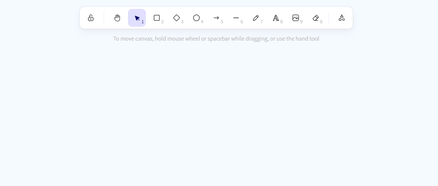
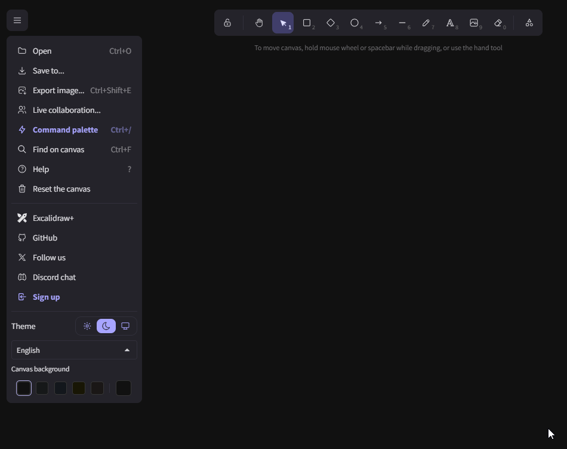

---
aliases:
  - Easy Blueprint Workflow
  - Floorplan Diagram Workflow
tags: 
publish: true
permalink: easy-schematic-workflow
date created: Thursday, March 20th 2025, 3:23 pm
date modified: Thursday, March 20th 2025, 4:15 pm
---

> [!summary] If I had to make schematics for a room or something

# A Workflow

## Using Excalidraw

1. Open Excalidraw in your browser
	1. [excalidraw.com > Collaborative whiteboarding made easy](https://excalidraw.com/) 
2. Start diagramming

### 1) Help Menu

- 

### 2) Making Blueprints

#### 4 quick tips:

1) Use the SHIFT and CTRL keys to make lines straight or get certain angles right
2) Look up near the toolbar for tips as you select things
	- 
3) Choose a light or dark theme to start
	- 
4) If you want to look at objects people have made, use the "Library" button (top right)
	- 

#### Blueprint example below:

# Other Tips & Tools

## Remove Background - for images on blueprint

Use this to remove backgrounds from images you want to use in the diagram

- [remove.bg > Upload Image](https://www.remove.bg/upload)

## AI Image & Art Generation

These are examples of places you can go to generate AI art for free

- [dezgo.com > Text-to-Image Flux - Online Free AI Image Generator](https://dezgo.com/text2image/sdxl)
- [huggingface.co > Spaces - Hugging Face](https://huggingface.co/spaces?category=image-generation)

## Free Icons (sometimes)

- [iconscout.com > Download 10.7 Million+ Icons](https://iconscout.com/)

## Use Your Emoji Keyboard

- (on MAC) Command + Control + Space
- (on Windows) Windows Buttion + "."

## Diagram Tools

- [lucidchart.com > Diagramming Powered By Intelligence](https://www.lucidchart.com/pages)
- [diagrams.net > draw.io](https://app.diagrams.net/)
- [tldraw.com > tldraw](https://www.tldraw.com/) - similar to Excalidraw, but not as capable