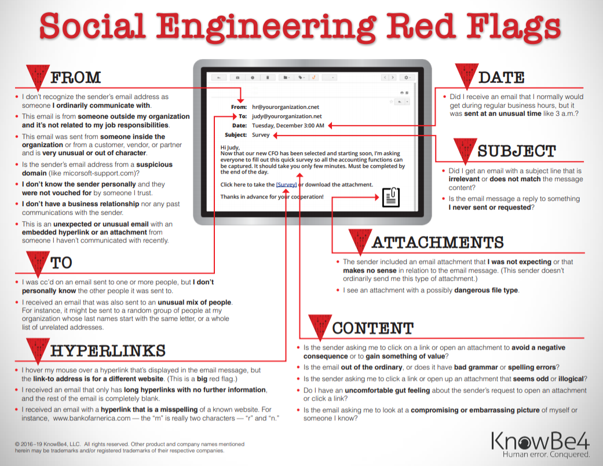

# The Short Version (4 Steps)

## 1. Check for email and SSN breaches

- [haveibeenpwned.com > Check if your email has been compromised in a data breach](https://haveibeenpwned.com/)
	- If you find an email that is compromised, and if you reuse the same password, then you will need to change your passwords - starting with your email account password
	- To do an "overhaul" of your passwords, follow SECTION 2 for getting the Bitwarden password manager, then store the login details for your account as you change the passwords on them.
	- Start with important accounts first and work your way down.
	- Change the passwords for...
		- **Email account** - hackers will use this to reset passwords on your other accounts, so secure it first
		- **Banking and financial accounts**
		- **Social media accounts**
- [npdbreach.com > National Public Data (NPD) Breach Check & Search](https://npdbreach.com/)
	- If you find your information here, then freeze and/or monitor your credit
		- [How to place or lift a security freeze on your credit report | USAGov](https://www.usa.gov/credit-freeze)

## 2. Password manager setup (if possible)

- Download Bitwarden Password Manager -> https://get.bitwarden.com/
- Learning center link (guides and how-to's)
	- https://bitwarden.com/help/learning-center/
- Set up biometric unlock (thumbprint or face), so it's easier to login
	- https://bitwarden.com/help/biometrics/#enable-unlock-with-biometrics
- You should have to only memorize 2 passwords now:
	- Email login - if you are using for 2-step verification
	- Bitwarden login
- Download, fill-out, and print the emergency readiness kit
	- Store this somewhere safe and/or fireproof
	- https://bitwarden.com/resources/bitwarden-security-readiness-kit/

## 3. Get MFA set up on an important account - 2 step verification

- Accounts to do it for:
	- Email account
	- Bank account or credit cards
- Guides:
	- [cisa.gov > Turn On MFA | CISA](https://www.cisa.gov/secure-our-world/turn-mfa)
	- [google.com > Turn on 2-Step Verification - Computer - Google Account Help](https://support.google.com/accounts/answer/185839)
- [apple.com > Use two-factor authentication for your Apple Account on iPhone](https://support.apple.com/guide/iphone/use-two-factor-authentication-iphd709a3c46/ios)

## 4. Data Privacy

- Google & Apple Privacy settings on phone
	- Change your Google/Android or iCloud/Apple settings to give you more privacy
- Email aliasing
	- Companies use your email to figure out who you are.  Email aliasing allows you to hide your real email from companies by using an alias for it.  
	- Use "+" or "plus" addresses with your current email provider (Ex: name+alias@email.com) 
		- iCloud
			- It seems that iCloud allows full aliases and not just the simple "+" sign method.  
			- [https://support.apple.com/en-ie/guide/icloud/mm6b1a490a/icloud](https://support.apple.com/en-ie/guide/icloud/mm6b1a490a/icloud)
		- Gmail
			- [https://support.google.com/mail/thread/227751799/how-google-email-alias-works-individual-account-not-google-workspace?hl=en](https://support.google.com/mail/thread/227751799/how-google-email-alias-works-individual-account-not-google-workspace?hl=en)
		- Outlook
			- [https://learn.microsoft.com/en-us/exchange/recipients-in-exchange-online/plus-addressing-in-exchange-online](https://learn.microsoft.com/en-us/exchange/recipients-in-exchange-online/plus-addressing-in-exchange-online)
	- For full email aliases, look into one of the below options
		- [SimpleLogin](https://simplelogin.io/)
		- [Addy / Anonaddy](https://addy.io/)
		- [DuckDuckGo Email Protection](https://duckduckgo.com/email/)

# Steps to Securing Your Digital Life

> [!tip] If you need help doing this
Find someone who knows technology, and show them this guide.  They may have better ways of doing things, but it's best to find someone who can help you with the technology and teach you.

## 1) Check if your email has been in a breach 

Go to the below website and type in your email to check for security breaches:
- [haveibeenpwned.com > Check if your email has been compromised in a data breach](https://haveibeenpwned.com/)

Last year (April 2024) had a huge breach of social security numbers.  Type in your name and address to see if your data was included.
- [npdbreach.com > National Public Data (NPD) Breach Check & Search](https://npdbreach.com/)

> [!info] FYI
> Typing in your email is not a security risk to you.  It merely checks your email against a public database of known security breaches.  No data is shared with the website other than to check against the database.

If you want your data removed from these websites then you may do so, but it's not easy
- [Link to guide for removing data](https://inteltechniques.com/exposure.html)

### If your passwords have been compromised

> [!attention] Start using a [password manager](🕸️%20UNSTRUCTURED/Home-Ec%202025/Home-Ec%202025.md#2%20Download%20and%20start%20using%20a%20password%20manager) and change the passwords on compromised websites.
> - If you have reused passwords on major accounts (e.g. email, bank, phone companies), then change those passwords first

## 2) Download and start using a password manager

> [!important] 
> Using a password manager means you...
> - Don't have to remember all of your passwords
> - Don't need to reuse passwords
> - Only need ONE good password
> - Your passwords autofill into login pages

> [!warning] Reuse of passwords is incredibly dangerous.  If one gets breached, then they all do.  If you've been reusing passwords and not using a password manager, then that's another reason you should start using one.

- Both of the below options are good:
	- [Bitwarden: Password Manager](https://get.bitwarden.com/)
	- [proton.me > Proton Pass: Password manager download](https://proton.me/pass/download)

> [!info]- Click for Password Statistics
> - **Passwords are the dominant form of authentication**
>     - **83% of organizations use password-based authentication** for some IT resources (JumpCloud's 2024 IT Trends Report)
>     - FIDO Alliance study from 2022
> - Data Breach Stats
>     - **80% of data breaches involved password stealing or cracking** at some step of the attack chain (Verizon DBIR 2022)
>     - **~40% of breaches were the result of an attacker using credentials to initially break into systems** (data from ~7000 companies - Verizon DBIR 2024)
>     - **68% of breaches involved a human element** (password management, social engineering) (data from ~14,700 companies - Verizon DBIR 2024)
>     - Out of all breaches, **~50% involved breaking into Web Applications with credentials** (including employee passwords) (data from 10,000+ companies Verizon DBIR 2024)
> - People reuse passwords
>     - **~60% of passwords were reused on multiple accounts** (SpyCloud Credential Exposure Report from 2021). This data is from a real-world sample of compromised user logins for millions of users on thousands of websites (1.5 billion+ logins total)

### Using Bitwarden for Passwords

- [bitwarden.com > Bitwarden Learning Center](https://bitwarden.com/help/learning-center/)

- You should have to only memorize 2 passwords now:
	- Email login - if you are using for 2-step verification
	- Bitwarden login
- Download, fill-out, and print the emergency readiness kit
	- Store this somewhere safe and/or fireproof
	- https://bitwarden.com/resources/bitwarden-security-readiness-kit/

> [!info] Random tips for Bitwarden:
> - Set up an "[organization](https://bitwarden.com/help/getting-started-organizations/)" in the app so you and your family can have shared passwords for things like streaming services, groceries, etc.
> - Use a [biometric](https://bitwarden.com/help/biometrics/) login for fast login - uses thumbprint or face if your phone allows it
> - Use the [password generator](https://bitwarden.com/help/generator/#tab-mobile-6xKx6UelBVUbCceB9IupEa) when you make new passwords
> - Use [Bitwarden Send](https://bitwarden.com/products/send/) to share sensitive documents and passwords

### What makes a good password?

A password needs to be:
1) Easy to remember
2) Easy to type
3) HARD to guess
	- Don't use pet names in it
	- Don't use birthdays
	- There must be a random word unrelated to you in it
	- Nothing that could be found on social media
4) Long - ideally 14+ characters, but 12 is "fine"

> [!tip] Look at the Bitwarden password generator online to 

### What about other places for storing passwords?

- Is using a physical notebook fine?
	- If you use paper for passwords, you MUST still make [good passwords](🕸️%20UNSTRUCTURED/Home-Ec%202025/Home-Ec%202025.md#What%20makes%20a%20good%20password) and NOT reuse them
- I don't recommend storing passwords in the browser
- Storing your passwords with Google or iCloud (via your iPhone) is better than nothing, but you won't get the convenience of [autofill](https://www.youtube.com/watch?v=V1BHbElRG2E) or be able to easily use it on multiple devices

## 3) Enable MFA or 2-Step Verification on Important Accounts

[cisa.gov > Turn On MFA | CISA](https://www.cisa.gov/secure-our-world/turn-mfa)

- Especially on...
	- Email account
	- Bank Account apps
	- Credit card apps

## 4) Defending against scams and "phishing" attacks

- Email and Text are untrustworthy - be skeptical
- Videos:
	- AI allows scammers to fake voices now -  [youtube.com > How scammers fake your voice? #shorts](https://www.youtube.com/watch?v=6HIENbTgLiA&list=PLAo444udA0qxfNyiQBGxLkMqfe_HWTq3e&index=3)

>[!summary] Quick tips for avoiding scams and "phishing"...
> - Don't click on links in emails from people you don't trust.
> - "If it seems too good to be true, it probably is."
> - "Would I be expecting this email from this person, at this time, in this way?"
> - "Hover before you click."
> - "Stop. Think. Connect." - connect to the person on a different communication channel if they're someone you know personally to see if they sent it.
> - When in doubt, type in the website into your browser and go there yourself to login
> - Never share a code sent to your email or phone number with someone.  Only type it back into the website that sent it to you.

### Spam blocking services

- [https://www.fcc.gov/consumers/guides/stop-unwanted-robocalls-and-texts](https://www.fcc.gov/consumers/guides/stop-unwanted-robocalls-and-texts)
- [https://www.fcc.gov/call-blocking](https://www.fcc.gov/call-blocking) - tons of apps mentioned by the FCC
- [Nomorobo](https://www.nomorobo.com/signup) - call blocking on mobile or VOIP

### Email Red Flags

## 5) Email Aliasing

- Adding a plus address to you current emails is a good start here. However, the bigger companies can still track you through these by simply taking what's after the "+" sign (the alias part) out.
- Adding a plus address like ([name+alias@email.com](mailto:name+alias@email.com)) with current email providers
    - iCloud
        - It seems that iCloud allows full aliases and not just the simple "+" sign method.  
        - [https://support.apple.com/en-ie/guide/icloud/mm6b1a490a/icloud](https://support.apple.com/en-ie/guide/icloud/mm6b1a490a/icloud)
    - Gmail
        - [https://support.google.com/mail/thread/227751799/how-google-email-alias-works-individual-account-not-google-workspace?hl=en](https://support.google.com/mail/thread/227751799/how-google-email-alias-works-individual-account-not-google-workspace?hl=en)
    - Outlook
        - [https://learn.microsoft.com/en-us/exchange/recipients-in-exchange-online/plus-addressing-in-exchange-online](https://learn.microsoft.com/en-us/exchange/recipients-in-exchange-online/plus-addressing-in-exchange-online)
- You can also add periods in the name part of your email and they will still send to your original email address
	- This one isn't as useful as the "+" trick, but it still works for something
	- If you have name@email.com....
	- na.me@email.com
	- n.ame@email.com
	- n.a.me@email.com
- Full email alias solutions
	- These are foolproof and can't be tracked back to you really
	- These can also integrate with some password managers to automatically create a new alias email when you create a new login.
	- Examples
		- [SimpleLogin](https://simplelogin.io/)
		- [Addy / Anonaddy](https://addy.io/)
		- [Firefox Relay](https://relay.firefox.com/)
		- [DuckDuckGo Email Protection](https://duckduckgo.com/email/)
---

## 6) For your children

- Protect them from going to dangerous websites - [covenanteyes.com > Screen Accountability™](https://www.covenanteyes.com/)
- Set up family settings on gaming consoles and other devices

## 7) Other Tips & Beyond

### Freeze Your Credit

Look up "how to freeze credit".

- [inteltechniques.com > Credit Freeze Guide](https://inteltechniques.com/freeze.html)
- [How to place or lift a security freeze on your credit report | USAGov](https://www.usa.gov/credit-freeze)

### Change the privacy settings on your most-used app/apps

- Choose an app to look at:
    - Your browser - Chrome, Safari
        - (or download a privacy respecting browser like "Brave browser")
    - Social media - Meta (Instagram, Facebook), YouTube, TikTok, Snapchat, Pinterest
    - **Google** or **Apple** accounts - Any privacy settings on these (including map apps)
    - Search Engine - also usually Google
        - (or start using a privacy-respecting search engine)

### Audit your phone's privacy settings

- Go through your phone's security and privacy settings
- Some guides on areas to look at:
	- Android guide example - [https://ssd.eff.org/module/how-to-get-to-know-android-privacy-and-security-settings#level-1-everyday-essentials](https://ssd.eff.org/module/how-to-get-to-know-android-privacy-and-security-settings#level-1-everyday-essentials)
	- iPhone guide example - [https://ssd.eff.org/module/how-to-get-to-know-iphone-privacy-and-security-settings#level-1-everyday-essentials](https://ssd.eff.org/module/how-to-get-to-know-iphone-privacy-and-security-settings#level-1-everyday-essentials)

### Use a Different "Search Engine" in Your Browser

I've been using Brave Search for years, but you may also like DuckDuckGo.

- Examples of privacy-focused search engines
	- Brave Search
	- DuckDuckGo
	- SearX
	- Startpage

### Turn On "DNS over HTTPS" in Your Browser Settings

Certainly! Here's a concise, step-by-step guide to configuring DNS over HTTPS (DoH) on various platforms:

---

**Windows 11:**

1. Click the **Start** menu and select **Settings**.​
2. Navigate to **Network & Internet**.​
3. Choose your active connection (**Wi-Fi** or **Ethernet**).​
4. Click on **Hardware Properties**.​
5. Under **DNS server assignment**, click **Edit**.​
6. Select **Manual** and toggle **IPv4** to **On**.​
7. Enter the preferred DNS server (e.g., `8.8.8.8`) and set **Preferred DNS encryption** to **Encrypted only (DNS over HTTPS)**.​
8. Repeat for **Alternate DNS** (e.g., `8.8.4.4`).​
9. Click **Save**.​

*Note: Ensure your chosen DNS servers support DoH.*

---

**macOS:**

1. Open **System Settings** and click **Network**.​
2. Select your active network connection and click **Details**.​
3. Go to the **DNS** tab.​
4. Click the **+** button to add a new DNS server (e.g., `1.1.1.1`).​
5. Add additional servers as needed (e.g., `1.0.0.1`).​
6. Click **OK** and then **Apply**.​

*Note: For system-wide DoH, consider using a configuration profile or third-party tools.*

---

**iOS (iPhone/iPad):**

1. Download a DoH configuration profile from a trusted provider (e.g., Cloudflare).​
2. Open **Settings** and tap **Profile Downloaded**.​
3. Tap **Install** and follow the prompts.​
4. Once installed, the device will use the specified DoH server.​

*Note: Manual DNS changes on iOS apply per Wi-Fi network and may not enable DoH.*

---

**Android 9 and Above:**

1. Open **Settings** and tap **Network & Internet**.​
2. Tap **Advanced**, then **Private DNS**.​
3. Select **Private DNS provider hostname**.​
4. Enter the hostname of a DoH provider (e.g., `dns.google`).​
5. Tap **Save**.​

*Note: Ensure the provider supports DoH and is entered correctly.*

---

**Mozilla Firefox:**

1. Open Firefox and click the **menu** button.​
2. Select **Settings** and navigate to **General**.​
3. Scroll down to **Network Settings** and click **Settings**.​
4. Check **Enable DNS over HTTPS**.​
5. Choose a provider or enter a custom one.​
6. Click **OK**.​

*Note: This enables DoH within Firefox only.*

---

**Google Chrome:**

1. Open Chrome and click the **three-dot menu**.​
2. Select **Settings** and go to **Privacy and security**.​
3. Click **Security**.​
4. Scroll down to **Advanced** and enable **Use secure DNS**.​
5. Choose a provider or enter a custom one.​

*Note: This enables DoH within Chrome only.*

---

**Microsoft Edge:**

1. Open Edge and click the **three-dot menu**.​
2. Select **Settings** and navigate to **Privacy, search, and services**.​
3. Scroll down to **Security**.​
4. Enable **Use secure DNS to specify how to lookup the network address for websites**.​
5. Choose a provider or enter a custom one.​

*Note: This enables DoH within Edge only.*

### Don't use a VPN (...usually)

- The only reason to use a VPN is if you travel a lot or you need access to a TV show from a different country on your phone.

- If you have to, the most trusted ones seem to be:
	- [protonvpn.com > The best VPN for speed and security](https://protonvpn.com/)
	- [mullvad.net > Free the internet](https://mullvad.net/en)
	- [ivpn.net > VPN for Privacy & Security | IVPN | Resist Online Surveillance](https://www.ivpn.net/en/)