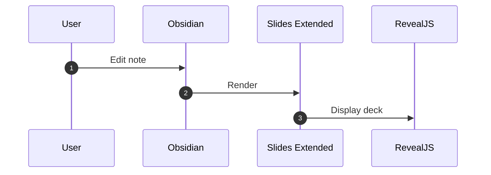
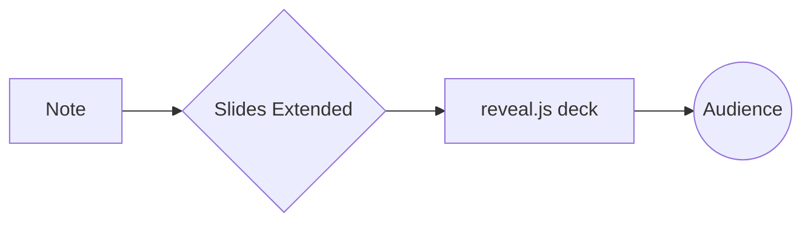

# Sequence

Flowchart

>Style mermaid with custom CSS if colors clash with your theme.

note:
> Styling Mermaid via CSS is effective; plugin supports custom CSS includes. :contentReference[oaicite:22]{index=22}