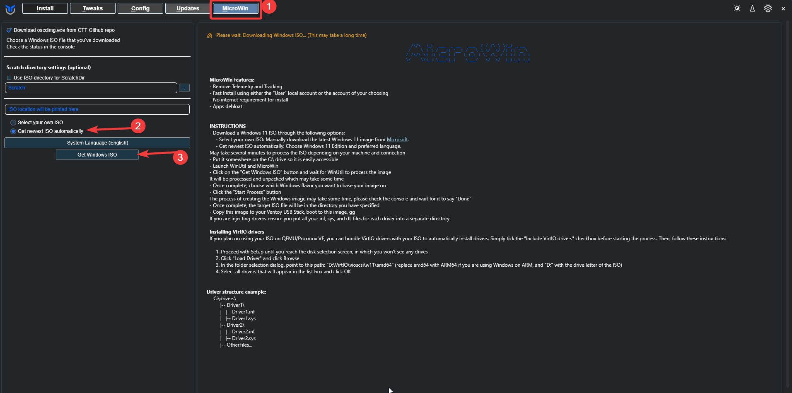

---
title:
permalink:
aliases: [Windows Desktop Environment and App Setup Tools - Provisioning Workstations]
tags: []
publish: true
date created: Wednesday, November 6th 2024, 11:36 am
date modified: Friday, October 31st 2025, 2:36 pm
---

[Home OS Provisioning & Resetting](../../📁%2007%20-%20Cybersader%20Arsenal/Home%20OS%20Provisioning%20&%20Resetting/Home%20OS%20Provisioning%20&%20Resetting.md)

# Home Windows 11 Provisioning – Visual, Modular, Copy‑Paste Guide

> **Audience:** beginner home‑labbers who want a repeatable Windows 11 setup with minimal clicks
>
> **Goal:** two clean paths – (A) Manual and (B) Streamlined image (MicroWin + Unattend) – with clear steps, default choices, and lots of copy‑paste commands.

---

## 🧭 Overview (pick a path)

```
PATH A: Manual (fast one‑off)                PATH B: Streamlined (hands‑off image)
┌───────────────────────────┐                ┌─────────────────────────────────────────┐
│ Make USB (Ventoy/Rufus/   │                │ MicroWin: build debloated ISO + local  │
│ balenaEtcher)             │                │ offline user (no MS account)           │
│ Install Windows           │                ├─────────────────────────────────────────┤
│ Run apps (Ninite/Winget/  │                │ NTLite (GUI) or $OEM$ structure:       │
│ Chocolatey)               │                │  • Embed autounattend.xml              │
│ Optional drivers          │                │  • Add post‑install scripts (apps)     │
└───────────────────────────┘                │  • Pack final ISO                      │
                                             └─────────────────────────────────────────┘
```

> **Do I need the Media Creation Tool (MCT) if I use MicroWin?** No. MicroWin can download the ISO for you. Use MCT only if you prefer that path.

---

## 🔧 Variables (edit once; reuse everywhere)

```powershell
# --- personalize these values ---
$UserName   = "cyberadmin"
$TimeZone   = "Eastern Standard Time"   # e.g., "Pacific Standard Time"
$ProvRoot   = "C:\provision"           # where we stage scripts/files
$WingetList = "$ProvRoot\packages.json" # winget export file
$NiniteEXE  = "$ProvRoot\Ninite.exe"    # optional Ninite bundle
$DriversDir = "$ProvRoot\drivers"       # optional .inf trees
```

---

## 📦 Tooling by Phase (light)

- **Bootable USB**: **[Ventoy](https://www.ventoy.net/)** (multi‑ISO), **[Rufus](https://rufus.ie/)** (Windows tweaks), **[balenaEtcher](https://www.balena.io/etcher/)** (simple)
- **Image/Unattend**: **[MicroWin (WinUtil)](https://winutil.christitus.com/userguide/microwin/)**, **[Schneegans Unattend Generator](https://schneegans.de/windows/unattend-generator/)**, **[UnattendedWinstall](https://github.com/memstechtips/UnattendedWinstall)**, **[NTLite](https://www.ntlite.com/)**
- **Apps**: **[Ninite](https://ninite.com/)**, **Winget** ([winget.run](https://winget.run/)), **[Chocolatey](https://chocolatey.org/)** / **[Chocolatey GUI](https://community.chocolatey.org/packages/chocolateygui)**
- **Drivers (example)**: **[Framework BIOS & Drivers](https://knowledgebase.frame.work/en_us/bios-and-drivers-downloads-rJ3PaCexh)**
- **Clone (optional)**: **[Clonezilla](https://clonezilla.org/)**

---

## 🅰️ Path A – Manual (quick & simple)

### A1) Make a bootable USB

- **Ventoy** (recommended for flexibility)

  1. Install Ventoy to USB → copy `Windows11.iso` to the USB → boot → pick ISO.
- **Rufus** (Windows‑specific toggles available)

  1. Select ISO → *leave “User Experience” bypasses unchecked if you’ll use your own unattend later* → Start.
- **balenaEtcher** (cross‑platform, simple)

  1. Select ISO → Select USB → Flash.

### A2) Install Windows + (optional) skip MS account

- If OOBE forces an online account:

  - Press **Shift+F10** → run: `OOBE\BYPASSNRO` → PC reboots → choose **I don’t have internet** → **Continue with limited setup**.
  - (Alternative helpers exist in Chris Titus’s WinUtil.)

### A3) Post‑install apps (pick a style)

- **Ninite (zero‑click bulk install)**

  1. Build your bundle at **[ninite.com](https://ninite.com/)** → run the downloaded EXE.
- **Winget (built‑in)**

  ```powershell
  winget search 7zip
  winget install --id=7zip.7zip --accept-package-agreements --accept-source-agreements

  # export your set for reuse next time
  winget export -o $WingetList

  # import on any machine
  winget import -i $WingetList --accept-package-agreements --accept-source-agreements
  ```
- **Chocolatey (PowerShell)**

  ```powershell
  Set-ExecutionPolicy Bypass -Scope Process -Force
  [Net.ServicePointManager]::SecurityProtocol = 3072
  iwr https://community.chocolatey.org/install.ps1 -UseBasicParsing | iex
  choco install 7zip git vscode -y
  ```

### A4) Drivers (safe & simple)

```powershell
# Stage drivers anywhere (e.g., $DriversDir) then run:
pnputil /add-driver $DriversDir\*.inf /subdirs /install
```

> 💡 **Tip:** Windows Update often installs most drivers. Only stage .inf drivers if storage/NIC/GPU are missing.

---
Perfect—here’s a **hand-holding, copy-paste-ready** expansion of **Path B (Streamlined)** with lots of links, defaults, and screenshot placeholders. It shows exactly where **MicroWin, Unattend, Winget, Chocolatey, Ninite** all plug in, plus safer driver options. I’ll assume Framework Laptop first, but keep it modular so you can swap driver packs anytime.

---

# Path B — Streamlined (MicroWin + Unattend + Auto-apps)

> [!TL;DR]
>
> - You **do not** need the Media Creation Tool if you let **MicroWin** download the ISO. ([winutil.christitus.com][1])
> - Bake your **autounattend.xml** + **post-install apps** into the image via **NTLite** (GUI), or drop a **$OEM$** folder with **SetupComplete.cmd**. ([Microsoft Learn][2])
> - Prefer **post-install** for apps (Ninite/Winget/Choco), so your image stays clean & modular. ([ninite.com][3])

---

## B2) Create your **autounattend.xml** (GUI generator + popular templates)

You’ll define **local user, privacy/timezone**, and a **FirstLogon command** that runs your **apps script**.

### Option 1 — **Schneegans** (GUI, easiest)

- Open **Schneegans Unattend Generator** → fill the form.
  **Recommended**:

  - User: `cyberadmin` (+ **Autologon: 1**)
  - Region/Language: `en-US` (or yours)
  - Time zone: `Eastern Standard Time` (or yours)
  - Privacy: opt-out/disable
  - Network: offline/skip MS account prompts when possible
- Add **FirstLogonCommands** entry (see snippet below).
- **Download** the XML and save as `autounattend.xml`.
  (Schneegans also documents the simple “copy XML to USB root” flow.) ([schneegans.de][7])

### Option 2 — Study/adapt **popular templates**

- **UnattendedWinstall** (memstechtips): curated unattend files (debloat, skip MS account, privacy), plus helper tooling. ([GitHub][8])
- **MS docs** (what FirstLogonCommands actually does & context of passes). ([Microsoft Learn][9])

> [📸 Placeholder] Schneegans “FirstLogonCommands” UI

**FirstLogonCommands snippet** (runs once at first admin login):

```xml
<FirstLogonCommands>
  <SynchronousCommand wcm:action="add">
    <Order>1</Order>
    <Description>Post-install apps</Description>
    <CommandLine>powershell -ExecutionPolicy Bypass -File C:\provision\postinstall.ps1</CommandLine>
  </SynchronousCommand>
</FirstLogonCommands>
```

*(Per MS docs, FirstLogonCommands run elevated for the first admin user.)* ([Microsoft Learn][9])

---

## B3) Build the “auto-apps” step (GUI or file-drop, minimal code)

> Best practice: keep apps **post-install** so you can change your app list without rebuilding Windows components.

### Option A — **NTLite** (GUI-first)

1. Open **NTLite**, **Add** your `Win11-MicroWin.iso`.
2. Go to **Unattended** → **Import** your `autounattend.xml`.
3. Add a **Post-setup / RunOnce** command to call your script:
   `powershell -ExecutionPolicy Bypass -File C:\provision\postinstall.ps1`
4. Use NTLite’s **Files** view to **add** these payloads into the ISO:

```
C:\provision\
  postinstall.ps1
  packages.json          # made by `winget export`
  Ninite.exe             # optional single EXE bundle
  \drivers\...           # optional .inf trees
```

5. **Build ISO** (Apply → Create ISO).
   *(NTLite community docs/threads show both RunOnce and SetupComplete patterns.)* ([NTLite][10])

### Option B — **$OEM$ folder** (no extra app, still GUI-light)

Inside the ISO’s folder tree, add:

```
\sources\$OEM$\$$\Setup\Scripts\SetupComplete.cmd
\sources\$OEM$\$1\provision\postinstall.ps1
\sources\$OEM$\$1\provision\packages.json
\sources\$OEM$\$1\provision\Ninite.exe
\sources\$OEM$\$1\provision\drivers\...
```

**SetupComplete.cmd** runs *after* Windows Setup completes (pre-first-login). Put it here:
`%WINDIR%\Setup\Scripts\SetupComplete.cmd` (the $OEM$ path above lands it there). ([Microsoft Learn][2])

Example `SetupComplete.cmd` (safe, idempotent):

```bat
@echo off
:: Winget import (if present)
if exist C:\provision\packages.json powershell -ExecutionPolicy Bypass -Command "winget import -i C:\provision\packages.json --accept-package-agreements --accept-source-agreements"

:: Ninite bundle (if present)
if exist C:\provision\Ninite.exe start /wait "" "C:\provision\Ninite.exe"

:: Chocolatey bootstrap (optional)
powershell -ExecutionPolicy Bypass -Command "[Net.ServicePointManager]::SecurityProtocol=3072; iwr https://community.chocolatey.org/install.ps1 -UseBasicParsing | iex"
choco install git vscode 7zip -y

:: Drivers (optional, safe)
if exist C:\provision\drivers pnputil /add-driver C:\provision\drivers\*.inf /subdirs /install

exit /b 0
```

*(MS “custom script” and “FirstLogon/RunOnce” docs cover when these hooks run and contexts.)* ([Microsoft Learn][2])

> [📸 Placeholder] NTLite “Unattended/RunOnce” panel & Files view
> [📸 Placeholder] $OEM$ folder structure in extracted ISO

---

## B4) The **apps** themselves (baseline commands you’ll reuse)

### Winget (built-in)

Search, export, import:

```powershell
# Find IDs
winget search firefox
winget search 7zip

# Export your current machine's app list (golden box)
winget export -o C:\provision\packages.json

# Import (silent-ish) on a fresh box
winget import -i C:\provision\packages.json --accept-package-agreements --accept-source-agreements
```

(Official `export`/`import` docs for schema, switches.) ([Microsoft Learn][11])

### Chocolatey

Install CLI, then apps:

```powershell
Set-ExecutionPolicy Bypass -Scope Process -Force
[Net.ServicePointManager]::SecurityProtocol = 3072
iwr https://community.chocolatey.org/install.ps1 -UseBasicParsing | iex

choco install git vscode 7zip -y
```

(Official install page & setup docs.) ([Chocolatey Software][12])

### Ninite

- Build a one-click installer at **ninite.com**; save as `C:\provision\Ninite.exe`; re-run later to update apps silently. ([ninite.com][3])

---

## B5) Drivers — simple & safe (no “trench warfare” required)

- **Best default**: let Windows Update pull most drivers after first boot.
- **If you need to stage drivers** (e.g., Wi-Fi/NVMe/odd NIC), place `.inf` folders under `C:\provision\drivers\` then run:

```powershell
pnputil /add-driver C:\provision\drivers\*.inf /subdirs /install
```

(PnPUtil syntax & usage from MS docs.) ([Microsoft Learn][13])

- **Export drivers** from a working machine to reuse next time:

```powershell
Export-WindowsDriver -Online -Destination C:\drivers
# or classic DISM
dism /online /export-driver /destination:C:\drivers
```

(Official PowerShell DISM cmdlet docs.) ([Microsoft Learn][14])

> [!TIP]
> Have *lots* of drivers? Some deployment pros prefer `pnpunattend.exe` over `pnputil` for very large driver sets—but for home use, `pnputil` is fine. ([Deployment Research][15])

---

## B0) Install MicroWin (WinUtil) — GUI debloat + local offline user

### Install Microwin

1. Open **MicroWin docs** and follow the launch/install method you prefer.

- Docs & overview: **MicroWin** (what it does; debloat, no-prompt images; local user) → *read this first*. ([winutil.christitus.com][1])

Winutil must be run in Admin mode because it performs system-wide tweaks. To achieve this, run PowerShell as an administrator. Here are a few ways to do it:

1. **Start menu Method:**
    
    - Right-click on the start menu.
    - Choose "Windows PowerShell (Admin)" (for Windows 10) or "Terminal (Admin)" (for Windows 11).
2. **Search and Launch Method:**
    
    - Press the Windows key.
    - Type "PowerShell" or "Terminal" (for Windows 11).
    - Press `Ctrl + Shift + Enter` or Right-click and choose "Run as administrator" to launch it with administrator privileges.

#### Launch Command

Stable Branch (Recommended):

```powershell
irm "https://christitus.com/win" | iex
```

Dev Branch:

```powershell
irm "https://christitus.com/windev" | iex
```

If you have Issues, refer to [Known Issues](https://winutil.christitus.com/knownissues/)

### Building an image with Microwin

1. In **MicroWin**:

- **Load/Download ISO** (you can skip MCT entirely).
- **Choose Edition** (Pro is typical).
- **Create local user** (ex: `cyberadmin`; autologon 1 time) to **avoid MS account** in OOBE.
- **Debloat & privacy** toggles → use defaults for now.
- **Driver injection**: leave **off** unless you *must* (we’ll install drivers safely later).
- **Build** your custom ISO (e.g., `Win11-MicroWin.iso`).
  *(MicroWin is designed to produce a minimal-bloat ISO with fewer setup interruptions.)* ([winutil.christitus.com][1])




---

## B1) Make the USB (pick one)

- **Ventoy** (multi-ISO): install Ventoy to USB, then copy your `Win11-MicroWin.iso` onto it → boot & select ISO. (No need to reformat for each ISO.) ([ventoy.net][4])
- **Rufus** (Windows-specific toggles if you needed them): write the ISO directly. (Use **rufus.ie**—avoid impersonators.) ([rufus.ie][5])
- **balenaEtcher** (simple, cross-platform “just flash”): write the ISO. (Use **balena.io/etcher**.) ([balena.io][6])

> [📸 Placeholder] Ventoy USB menu / Rufus write dialog / Etcher flash screen

---

## B6) Boot & install (hands-off)

1. Boot your **Ventoy / Rufus / Etcher** USB and choose the **MicroWin ISO**. ([ventoy.net][4])
2. The install should be largely **unattended** (local user pre-created). ([winutil.christitus.com][1])
3. On first admin logon (or immediately after setup if you used **SetupComplete**), your **apps** install routine runs (Winget import, Ninite, Choco, Drivers). ([Microsoft Learn][9])

> [📸 Placeholder] OOBE skipping MS account (because local user was pre-created)

---

## B7) Troubleshooting quickies

- **SetupComplete didn’t run?** Consider moving tasks to **Post-setup/RunOnce** (NTLite schedules them for you); also confirm the exact path `%WINDIR%\Setup\Scripts\SetupComplete.cmd`. ([NTLite][16])
- **FirstLogonCommands didn’t fire?** Ensure it’s in the **oobeSystem** pass and runs a simple command first (e.g., create a log), then call PowerShell. ([Microsoft Learn][9])

---

## B8) Optional: capture a “factory image” for instant resets

Once everything is perfect, take a **Clonezilla** image (save/restore). For new hardware, **sysprep /generalize** first, then image, so the first boot re-OOBEs (your unattend can handle it). ([ninite.com][3])

---

## Quick reference (pasteables)

**File map (if not using NTLite’s Files pane):**

```
C:\provision\
  postinstall.ps1
  packages.json
  Ninite.exe
  \drivers\...

\sources\$OEM$\$$\Setup\Scripts\SetupComplete.cmd
```

**Winget baseline:**

```powershell
winget export -o C:\provision\packages.json
winget import -i C:\provision\packages.json --accept-package-agreements --accept-source-agreements
```

**Choco one-liner + a few apps:**

```powershell
Set-ExecutionPolicy Bypass -Scope Process -Force
[Net.ServicePointManager]::SecurityProtocol = 3072
iwr https://community.chocolatey.org/install.ps1 -UseBasicParsing | iex
choco install git vscode 7zip -y
```

**Drivers (safe):**

```powershell
pnputil /add-driver C:\provision\drivers\*.inf /subdirs /install
```

---

### Links you’ll actually use (grouped)

- **MicroWin (WinUtil)**: docs & features. ([winutil.christitus.com][1])
- **Unattend GUI**: Schneegans generator + usage. ([schneegans.de][7])
- **Popular templates**: UnattendedWinstall guide & repo. ([Memorys Tech Tips][17])
- **Unattend hooks**: FirstLogonCommands; custom setup scripts (SetupComplete/RunOnce). ([Microsoft Learn][9])
- **App managers**: Ninite; Winget import/export; Chocolatey install/setup. ([ninite.com][3])
- **Drivers**: pnputil; Export-WindowsDriver. ([Microsoft Learn][13])
- **USB writers**: Ventoy / GitHub / SourceForge; Rufus site/downloads; balenaEtcher site/GitHub. ([ventoy.net][4])

---

## 🎛️ Optional Driver Strategies (choose 1)

- **Do nothing** (let Windows Update handle it)
- **Stage + pnputil** (safe): place `.inf` trees in `C:\provision\drivers` and auto‑install
- **Export from a working PC** (same model):

  ```cmd
  dism /online /export-driver /destination:C:\drivers
  ```
- **Inject in image** (advanced): use NTLite’s driver integration

> ⚠️ Only inject storage/NIC drivers if Windows can’t see the disk/network during setup.

---

## 💿 USB Writers – which and when

- **Ventoy** – multi‑ISO toolbox; keep stock ISO + MicroWin ISO + recovery tools together
- **Rufus** – great if you want Windows‑specific bypass toggles *on the USB*
- **balenaEtcher** – simple, cross‑platform “just flash it” GUI

---

## 🧰 Frequently reused commands (copy‑paste)

```powershell
# Winget export/import
winget export -o $WingetList
winget import -i $WingetList --accept-package-agreements --accept-source-agreements

# Chocolatey bootstrap + a few apps
Set-ExecutionPolicy Bypass -Scope Process -Force
[Net.ServicePointManager]::SecurityProtocol = 3072
iwr https://community.chocolatey.org/install.ps1 -UseBasicParsing | iex
choco install 7zip git vscode -y

# Driver install
pnputil /add-driver $DriversDir\*.inf /subdirs /install
```

---

## 🧊 Optional: Capture a “perfect state” image

- **Clonezilla**: boot **[Clonezilla Live](https://clonezilla.org/clonezilla-live.php)** → *save disk image* to external drive → later *restore* in minutes
- **For other hardware**: generalize first

  ```cmd
  sysprep /generalize /oobe /shutdown
  ```

  then image with Clonezilla; your unattend handles the next OOBE.

---

## 📚 Resources & Links (consolidated)

- **Media/USB**: [Download Windows 11 (Microsoft)](https://www.microsoft.com/en-us/software-download/windows11) · [Ventoy](https://www.ventoy.net/) · [Rufus](https://rufus.ie/) · [balenaEtcher](https://www.balena.io/etcher/)
- **Debloat/Unattend**: [MicroWin (WinUtil)](https://winutil.christitus.com/userguide/microwin/) · [Schneegans Unattend Generator](https://schneegans.de/windows/unattend-generator/) · [UnattendedWinstall](https://github.com/memstechtips/UnattendedWinstall) · [NTLite](https://www.ntlite.com/) · [MSMG Toolkit](https://msmgtoolkit.in/)
- **Apps**: [Ninite](https://ninite.com/) · [winget.run](https://winget.run/) · [Chocolatey](https://chocolatey.org/) · [Chocolatey GUI](https://community.chocolatey.org/packages/chocolateygui)
- **Drivers (Framework)**: [Framework BIOS & Drivers](https://knowledgebase.frame.work/en_us/bios-and-drivers-downloads-rJ3PaCexh)
- **Imaging**: [Clonezilla](https://clonezilla.org/) · [Clonezilla Live](https://clonezilla.org/clonezilla-live.php)
- **Docs**: [Provisioning packages (MS)](https://learn.microsoft.com/en-us/windows/configuration/provisioning-packages/provisioning-packages)

---

### ✅ What you get

- **Manual path** for fast resets
- **Streamlined image** that: creates a local user, skips MS account, debloats, and **auto‑installs apps**
- Minimal code; GUI‑centric build
- Modular file layout so you can tweak app lists without rebuilding everything


---

# References

[1]: https://winutil.christitus.com/userguide/microwin/?utm_source=chatgpt.com "Microwin - Winutil Documentation - Chris Titus Tech"
[2]: https://learn.microsoft.com/en-us/windows-hardware/manufacture/desktop/add-a-custom-script-to-windows-setup?view=windows-11&utm_source=chatgpt.com "Add a Custom Script to Windows Setup"
[3]: https://ninite.com/?utm_source=chatgpt.com "Ninite - Install or Update Multiple Apps at Once"
[4]: https://www.ventoy.net/?utm_source=chatgpt.com "Ventoy"
[5]: https://rufus.ie/?utm_source=chatgpt.com "Rufus - Create bootable USB drives the easy way"
[6]: https://www.balena.io/etcher?utm_source=chatgpt.com "balenaEtcher - Flash OS images to SD cards & USB drives"
[7]: https://schneegans.de/windows/unattend-generator/?utm_source=chatgpt.com "Generate autounattend.xml files for Windows 10/11"
[8]: https://github.com/memstechtips/UnattendedWinstall?utm_source=chatgpt.com "memstechtips/UnattendedWinstall"
[9]: https://learn.microsoft.com/en-us/windows-hardware/customize/desktop/unattend/microsoft-windows-shell-setup-firstlogoncommands?utm_source=chatgpt.com "FirstLogonCommands"
[10]: https://www.ntlite.com/community/index.php?threads%2Fdebugging-post-setup-commands.3966%2F=&utm_source=chatgpt.com "Debugging Post-Setup Commands"
[11]: https://learn.microsoft.com/en-us/windows/package-manager/winget/export?utm_source=chatgpt.com "export command (winget)"
[12]: https://chocolatey.org/install?utm_source=chatgpt.com "Installing Chocolatey"
[13]: https://learn.microsoft.com/en-us/windows-hardware/drivers/devtest/pnputil-command-syntax?utm_source=chatgpt.com "PnPUtil Command Syntax - Windows drivers"
[14]: https://learn.microsoft.com/en-us/powershell/module/dism/export-windowsdriver?view=windowsserver2025-ps&utm_source=chatgpt.com "Export-WindowsDriver (Dism)"
[15]: https://www.deploymentresearch.com/back-to-basics-pnputil-exe-vs-pnpunattend-exe/?utm_source=chatgpt.com "Basics - Updating Drivers - pnputil.exe vs. pnpunattend.exe"
[16]: https://www.ntlite.com/community/index.php?threads%2Fsetupcomplete-not-running.5429%2F=&utm_source=chatgpt.com "SetupComplete not running"
[17]: https://memstechtips.com/customize-windows-installs-unattendedwinstall/?utm_source=chatgpt.com "Customize Windows Installs Easily With UnattendedWinstall!"

---

Here’s your **refined, visual, step-by-step Markdown guide** that fixes the order, bakes apps + unattend into the MicroWin flow, adds screenshot placeholders, and moves all loose links to a single **Resources** section at the end. It’s optimized for a beginner home-labber.

---
---
---
---
---
---
---
---
---
---
---
---
---
---
---
---
---
---
---
---
---
---
---
---
---
---
---
---
---
---
---
---
---
---
---
---
---
---
---
---
---
---
---
---
---
---
---
---
---
---
---
---
---
---
---
---
---
---
---
---
---
---
---
---
---
---
---
---
---
---
---
---
---
---
---
---
---
---
---
---
---
---
---
---
---
---
---
---
---
---
---
---
---
---
---
---
---
---
---

# Home Windows 11 Provisioning — Streamlined + Manual (Beginner-Friendly)

> **Audience:** beginner home-labbers  
> **Outcome:** repeatable Windows 11 install with **local user**, **debloat**, and **auto-installed apps** — either **Manual (Path A)** or **Streamlined Image (Path B)**.  
> **Order of operations:** **prep first** (apps lists, `autounattend.xml`, drivers, post-install script) → then **build the image** (MicroWin) → then **write USB & install**.

---

## 🧭 Choose a path

```
PATH A: Manual (fastest one-off)                     PATH B: Streamlined (hands-off image)
1) Make USB (Ventoy/Rufus/balenaEtcher)              1) PREP (apps, unattend, drivers, script)   ← do this first
2) Install Windows (optionally bypass MS acct)       2) Build ISO with MicroWin (debloat + local user)
3) Post-install apps (Ninite/Winget/Choco)           3) Embed your PREP into ISO (NTLite or $OEM$ files)
4) (Optional) drivers via pnputil                     4) Write USB → Boot → Install runs mostly unattended
```

---

## 🔧 Variables you’ll reuse (edit once)

```powershell
$UserName   = "cyberadmin"                  # local offline admin
$TimeZone   = "Eastern Standard Time"       # e.g., "Pacific Standard Time"
$ProvRoot   = "C:\provision"                # staging folder on target
$WingetList = "$ProvRoot\packages.json"     # winget export file
$NiniteEXE  = "$ProvRoot\Ninite.exe"        # optional Ninite bundle
$DriversDir = "$ProvRoot\drivers"           # optional .inf drivers
```

---

# ✅ PREP (do this **before** image building)

> This section builds your **app stack**, **unattend file**, **drivers**, and **post-install script**. You’ll plug these into MicroWin’s ISO in Path B, or run them manually in Path A.

### 1) Build your app list(s)

#### Building Apps Packages (GUI-based)

- Tools
	- [Ninite - Install or Update Multiple Apps at Once](https://ninite.com/)
		- Get the resulting exe
		- Older tool, so I lean towards Winget and Chocolatey instead
	- Winget
		- [winget.run | Finding winget packages made simple.](https://winget.run/)
			- Search and select the apps > Download the packages json
	- Chocolatey
		- [chocolatey.org > Packages](https://community.chocolatey.org/packages)
	- Win Util
		- Install > Select Apps > Upper Right Cog Icon > Export
		- 
	- Raw exe's ???
		- .

#### CLI-based

**Winget (built-in)** — _discover, export, import_

```powershell
# Find exact IDs
winget search 7zip
winget search firefox

# Export your “golden” box app list for reuse
winget export -o $WingetList    # creates packages.json  (docs: export/import)
```

Use later to bulk install:

```powershell
winget import -i $WingetList --accept-package-agreements --accept-source-agreements
```

Docs: First-party `winget` export/import. ([Microsoft Learn](https://learn.microsoft.com/en-us/windows/package-manager/winget/export?utm_source=chatgpt.com "export command (winget)"))

**Chocolatey (optional)** — _big catalog, easy scripting_

```powershell
Set-ExecutionPolicy Bypass -Scope Process -Force
[Net.ServicePointManager]::SecurityProtocol = 3072
iwr https://community.chocolatey.org/install.ps1 -UseBasicParsing | iex
choco install 7zip git vscode -y
```

Install instructions: Chocolatey official. ([Chocolatey Software](https://chocolatey.org/install?utm_source=chatgpt.com "Installing Chocolatey"))

**Ninite (optional)** — _one EXE; zero-click_

- Build your bundle at **ninite.com**, save to `$NiniteEXE`. (Re-run it later to update apps silently.) ([Microsoft Learn](https://learn.microsoft.com/en-us/windows/package-manager/winget/export?utm_source=chatgpt.com "export command (winget)"))
    

> [📸 Placeholder] Screenshot: your `packages.json` in a file explorer  
> [📸 Placeholder] Screenshot: your Ninite selection page

---

### 2) Create `autounattend.xml` (local user + FirstLogon to run apps)

#### Autounattend.xml Templates

> [!info] These are what would be loaded in with MicroWin

- [github.com > memstechtips/UnattendedWinstall: Personalized Unattended Answer Files that helps automatically debloat and customize Windows 10 & 11 during the installation process.](https://github.com/memstechtips/UnattendedWinstall)
- [github.com > winutil/config/autounattend.xml at main · ChrisTitusTech/winutil](https://github.com/ChrisTitusTech/winutil/blob/main/config/autounattend.xml)

#### **Easiest (GUI): Schneegans Generator**

> [schneegans.de > Generate autounattend.xml files for Windows 10/11](https://schneegans.de/windows/unattend-generator/)

- I wanted to go off of the Winutil template, then extend from there
	- Download the XML file from - [github.com > winutil/config/autounattend.xml at main · ChrisTitusTech/winutil](https://github.com/ChrisTitusTech/winutil/blob/main/config/autounattend.xml)
- At the [generator](https://schneegans.de/windows/unattend-generator/)
	- Top left > Choose file > choose the above downloaded `autounattend.xml`
	- Import file

- Make your own changes
	- If you have a license key, you can even input that

- Open the generator and fill in:
    - **User:** `cyberadmin` (Autologon = 1)
    - **Locale/Language:** en-US (or yours)
    - **Time zone:** _Eastern Standard Time_ (or yours)
    - **Privacy:** opt-out/disable
    - **Network:** prefer offline to avoid MS account prompt
- Add a **FirstLogonCommands** entry to call your post-install script:

```xml
<FirstLogonCommands>
  <SynchronousCommand wcm:action="add">
    <Order>1</Order>
    <Description>Post-install apps</Description>
    <CommandLine>powershell -ExecutionPolicy Bypass -File C:\provision\postinstall.ps1</CommandLine>
  </SynchronousCommand>
</FirstLogonCommands>
```

- **Download** to `autounattend.xml`.  
    Generator & usage docs. ([schneegans.de](https://schneegans.de/windows/unattend-generator/?utm_source=chatgpt.com "Generate autounattend.xml files for Windows 10/11"))

**What FirstLogonCommands does:** runs once at the **first admin logon** with elevated rights (oobeSystem pass). ([Microsoft Learn](https://learn.microsoft.com/en-us/windows-hardware/customize/desktop/unattend/microsoft-windows-shell-setup-firstlogoncommands?utm_source=chatgpt.com "FirstLogonCommands"))

> [📸 Placeholder] Screenshot: Schneegans “FirstLogonCommands” UI


---

### 3) Prepare drivers (optional, safe)

#### Packaging up an existing driver state

Most devices update via Windows Update. If you need staged drivers (Wi-Fi, storage, odd NIC):

```powershell
# Export drivers from a working same-model machine (either cmdlet or DISM):
Export-WindowsDriver -Online -Destination C:\drivers
# or:
dism /online /export-driver /destination:C:\drivers
```

Then later install them on the fresh box:

```powershell
pnputil /add-driver C:\provision\drivers\*.inf /subdirs /install
```

Docs: `Export-WindowsDriver`, `pnputil`. ([Microsoft Learn](https://learn.microsoft.com/en-us/powershell/module/dism/export-windowsdriver?view=windowsserver2025-ps&utm_source=chatgpt.com "Export-WindowsDriver (Dism)"))

> [📸 Placeholder] Screenshot: your `C:\drivers` folder with .inf trees

#### Putting drivers in with the install (Microwin)

- We can package up drivers for the hardware that the Windows OS will be running on

---

### 4) Create `postinstall.ps1` (one script to rule them all)

```powershell
# C:\provision\postinstall.ps1
# 1) Winget list (if present)
if (Test-Path "$env:SystemDrive\provision\packages.json") {
  winget import -i "$env:SystemDrive\provision\packages.json" --accept-package-agreements --accept-source-agreements
}

# 2) Ninite bundle (if present)
if (Test-Path "$env:SystemDrive\provision\Ninite.exe") {
  Start-Process -Wait -FilePath "$env:SystemDrive\provision\Ninite.exe"
}

# 3) Chocolatey bootstrap (optional)
if (-not (Get-Command choco -ErrorAction SilentlyContinue)) {
  Set-ExecutionPolicy Bypass -Scope Process -Force
  [Net.ServicePointManager]::SecurityProtocol = 3072
  iwr https://community.chocolatey.org/install.ps1 -UseBasicParsing | iex
}
choco install 7zip git vscode -y

# 4) Drivers (optional)
if (Test-Path "$env:SystemDrive\provision\drivers") {
  pnputil /add-driver "$env:SystemDrive\provision\drivers\*.inf" /subdirs /install | Out-Null
}
```

> [📸 Placeholder] Screenshot: `postinstall.ps1` open in VS Code

---

# 🅱️ Path B — Streamlined (MicroWin ISO + Unattend + Apps)

> **Flow:** Use MicroWin to build a **debloated Windows ISO** with a **local offline user**, then **embed your PREP** (unattend + apps + script + drivers) and create a final ISO. MicroWin docs; NTLite/$OEM$ embedding; SetupComplete/FirstLogon references. ([winutil.christitus.com](https://winutil.christitus.com/userguide/microwin/?utm_source=chatgpt.com "Microwin - Winutil Documentation - Chris Titus Tech"))

## B0) Install/launch **MicroWin (WinUtil)**

Run an elevated PowerShell/Terminal:

```powershell
irm "https://christitus.com/win" | iex   # stable
# irm "https://christitus.com/windev" | iex   # dev (optional)
```

Open **MicroWin**:

- **Load/Download ISO** (you can **skip MCT** completely).
- **Choose edition** (Pro is common).
- **Create local user** (use `cyberadmin`, Autologon 1) → avoids MS account prompts.
- **Debloat & privacy**: enable defaults.
- **Driver injection**: **skip** unless required (you’ll handle drivers post-install via `pnputil`).  
    MicroWin overview & capabilities. ([winutil.christitus.com](https://winutil.christitus.com/userguide/microwin/?utm_source=chatgpt.com "Microwin - Winutil Documentation - Chris Titus Tech"))

> [📸 Placeholder] MicroWin Home screen  
> [📸 Placeholder] MicroWin “Local User / Debloat” settings

**Build** the base ISO, e.g., `Win11-MicroWin.iso`.

---

## B1) Embed your PREP into the ISO (pick 1 of 2)

### Option 1 — **NTLite** (GUI-first)

1. Open **NTLite**, **Add** → Image file (ISO) → select `Win11-MicroWin.iso`
2. **Unattended** → **Import** your `autounattend.xml`
3. **Post-setup / RunOnce** → add:

```
powershell -ExecutionPolicy Bypass -File C:\provision\postinstall.ps1
```

4. **Files** view → add payloads into ISO:

```
C:\provision\
  postinstall.ps1
  packages.json           # from winget export
  Ninite.exe              # optional
  \drivers\...            # optional .inf trees
```

5. **Apply → Create ISO** → get `Win11-MicroWin-PREP.iso`.

> [📸 Placeholder] NTLite “Unattended/RunOnce” panel  
> [📸 Placeholder] NTLite “Files” view showing C:\provision folder

(Community docs frequently show Post-setup and troubleshooting.) ([Microsoft Learn](https://learn.microsoft.com/en-us/answers/questions/4098541/windows-setup-configuration?utm_source=chatgpt.com "Windows Setup Configuration - Microsoft Q&A"))

---

### Option 2 — **$OEM$ folder** (no extra GUI tool)

If you extracted the ISO to a folder, add this structure:

```
\sources\$OEM$\$$\Setup\Scripts\SetupComplete.cmd
\sources\$OEM$\$1\provision\postinstall.ps1
\sources\$OEM$\$1\provision\packages.json
\sources\$OEM$\$1\provision\Ninite.exe
\sources\$OEM$\$1\provision\drivers\...
```

`SetupComplete.cmd` (runs after Setup, before first logon):

```bat
@echo off
if exist C:\provision\packages.json powershell -ExecutionPolicy Bypass -Command "winget import -i C:\provision\packages.json --accept-package-agreements --accept-source-agreements"
if exist C:\provision\Ninite.exe start /wait "" "C:\provision\Ninite.exe"
powershell -ExecutionPolicy Bypass -Command "[Net.ServicePointManager]::SecurityProtocol=3072; iwr https://community.chocolatey.org/install.ps1 -UseBasicParsing | iex"
choco install git vscode 7zip -y
if exist C:\provision\drivers pnputil /add-driver C:\provision\drivers\*.inf /subdirs /install
exit /b 0
```

Official `SetupComplete.cmd` guidance (where it runs, placement). ([Microsoft Learn](https://learn.microsoft.com/en-us/windows-hardware/manufacture/desktop/add-a-custom-script-to-windows-setup?view=windows-11&utm_source=chatgpt.com "Add a Custom Script to Windows Setup"))

> [📸 Placeholder] Screenshot: `$OEM$` tree under `\sources\`  
> [📸 Placeholder] Screenshot: `SetupComplete.cmd` open in Notepad

---

## B2) Write USB and install

Use **one** of these writers:

- **Ventoy**: install to USB once → copy `Win11-MicroWin-PREP.iso` onto it → boot → choose ISO (multi-ISO toolbox). ([Microsoft Learn](https://learn.microsoft.com/en-us/windows/package-manager/winget/export?utm_source=chatgpt.com "export command (winget)"))
- **Rufus**: select ISO → Start (leave “User Experience” toggles **off** since you’re using unattend). ([Chocolatey Software](https://chocolatey.org/install?utm_source=chatgpt.com "Installing Chocolatey"))
- **balenaEtcher**: select ISO → select USB → Flash. ([Microsoft Learn](https://learn.microsoft.com/en-us/windows-hardware/drivers/devtest/pnputil-command-syntax?utm_source=chatgpt.com "PnPUtil Command Syntax - Windows drivers"))

> [📸 Placeholder] Ventoy boot menu with your ISO  
> [📸 Placeholder] Rufus write dialog / Etcher flash dialog

---

## B3) First boot expectations

- OOBE should **not** force a Microsoft account (MicroWin user pre-created). ([winutil.christitus.com](https://winutil.christitus.com/userguide/microwin/?utm_source=chatgpt.com "Microwin - Winutil Documentation - Chris Titus Tech"))
- At first admin logon, your **FirstLogonCommands** or **SetupComplete** will run and **install apps** + **drivers**. ([Microsoft Learn](https://learn.microsoft.com/en-us/windows-hardware/customize/desktop/unattend/microsoft-windows-shell-setup-firstlogoncommands?utm_source=chatgpt.com "FirstLogonCommands"))

> [📸 Placeholder] Screenshot: desktop after apps install finishes

---

# 🅰️ Path A — Manual (quickest reset)

> Get a private, streamlined, and less-bloated setup without building an image

1. **Write USB** (Ventoy / Rufus / Etcher). ([Microsoft Learn](https://learn.microsoft.com/en-us/windows/package-manager/winget/export?utm_source=chatgpt.com "export command (winget)"))
2. **Install Windows**. If OOBE forces online account: **Shift+F10** → `OOBE\BYPASSNRO` → reboot → **Continue with limited setup** (local user). _(Manual fallback — you won’t need this in Path B.)_
	1. use the Chris Titus command - [youtube.com > Microsoft FORCES Online Accounts](https://www.youtube.com/watch?v=aEWb1otLVPo)
	2. [github.com > ChrisTitusTech/bypassnro: Fixing Microsoft's removal of BypassNRO](https://github.com/ChrisTitusTech/bypassnro)
	3. 
3. **Apps**: run Ninite once; or `winget import -i $WingetList`; or Chocolatey one-liner + installs. ([Microsoft Learn](https://learn.microsoft.com/en-us/windows/package-manager/winget/export?utm_source=chatgpt.com "export command (winget)"))
4. **Drivers** (if needed):

```powershell
pnputil /add-driver $DriversDir\*.inf /subdirs /install
```

Docs. ([Microsoft Learn](https://learn.microsoft.com/en-us/windows-hardware/drivers/devtest/pnputil-command-syntax?utm_source=chatgpt.com "PnPUtil Command Syntax - Windows drivers"))

---

# 📦 Reusable file map

```
C:\provision\
  postinstall.ps1
  packages.json
  Ninite.exe
  \drivers\...

# If you use $OEM$ method:
\sources\$OEM$\$$\Setup\Scripts\SetupComplete.cmd
```

---

# 🧊 Optional: capture a “factory image” for instant resets

- **Clonezilla Live**: boot → _save disk image_ to an external drive → later _restore_ in minutes. ([Microsoft Learn](https://learn.microsoft.com/en-us/windows/package-manager/winget/export?utm_source=chatgpt.com "export command (winget)"))
- For **other hardware**, first:

```cmd
sysprep /generalize /oobe /shutdown
```

then image; first boot will re-OOBE (your unattend handles it). (General Windows setup scripting docs.) ([Microsoft Learn](https://learn.microsoft.com/en-us/windows-hardware/manufacture/desktop/add-a-custom-script-to-windows-setup?view=windows-11&utm_source=chatgpt.com "Add a Custom Script to Windows Setup"))

> [📸 Placeholder] Screenshot: Clonezilla “save image” screen

---

# 📚 Resources (all links consolidated)

- [github.com > CodingWonders/DISMTools: The connected place for Windows system administration](https://github.com/CodingWonders/DISMTools)
- 

**Image & Debloat**

- MicroWin (WinUtil) overview & docs. ([winutil.christitus.com](https://winutil.christitus.com/userguide/microwin/?utm_source=chatgpt.com "Microwin - Winutil Documentation - Chris Titus Tech"))

**Unattend**

- Schneegans Unattend Generator (GUI). ([schneegans.de](https://schneegans.de/windows/unattend-generator/?utm_source=chatgpt.com "Generate autounattend.xml files for Windows 10/11"))
- Schneegans “How to use” (USB root copy). ([schneegans.de](https://schneegans.de/windows/unattend-generator/usage/?utm_source=chatgpt.com "Use autounattend.xml files to install Windows 10/11"))
- Microsoft: `FirstLogonCommands` (oobeSystem pass, elevated, order). ([Microsoft Learn](https://learn.microsoft.com/en-us/windows-hardware/customize/desktop/unattend/microsoft-windows-shell-setup-firstlogoncommands?utm_source=chatgpt.com "FirstLogonCommands"))
- Microsoft: Add custom scripts to Windows Setup (`SetupComplete.cmd`). ([Microsoft Learn](https://learn.microsoft.com/en-us/windows-hardware/manufacture/desktop/add-a-custom-script-to-windows-setup?view=windows-11&utm_source=chatgpt.com "Add a Custom Script to Windows Setup"))

**Apps**

- Microsoft: `winget` export/import + overview. ([Microsoft Learn](https://learn.microsoft.com/en-us/windows/package-manager/winget/export?utm_source=chatgpt.com "export command (winget)"))
- Chocolatey install (official + docs). ([Chocolatey Software](https://chocolatey.org/install?utm_source=chatgpt.com "Installing Chocolatey"))
- Ninite (build zero-click installer). ([Microsoft Learn](https://learn.microsoft.com/en-us/windows/package-manager/winget/export?utm_source=chatgpt.com "export command (winget)"))

**Drivers**

- Microsoft: `pnputil` (syntax & usage). ([Microsoft Learn](https://learn.microsoft.com/en-us/windows-hardware/drivers/devtest/pnputil-command-syntax?utm_source=chatgpt.com "PnPUtil Command Syntax - Windows drivers"))
- Microsoft: `Export-WindowsDriver`. ([Microsoft Learn](https://learn.microsoft.com/en-us/powershell/module/dism/export-windowsdriver?view=windowsserver2025-ps&utm_source=chatgpt.com "Export-WindowsDriver (Dism)"))

**USB Writers**

- Ventoy (multi-ISO USB). ([Microsoft Learn](https://learn.microsoft.com/en-us/windows/package-manager/winget/export?utm_source=chatgpt.com "export command (winget)"))
- Rufus (Windows USB). ([Chocolatey Software](https://chocolatey.org/install?utm_source=chatgpt.com "Installing Chocolatey"))
- balenaEtcher (simple “flash it”). ([Microsoft Learn](https://learn.microsoft.com/en-us/windows-hardware/drivers/devtest/pnputil-command-syntax?utm_source=chatgpt.com "PnPUtil Command Syntax - Windows drivers"))


- [youtube.com > How to Setup Windows PROPERLY](https://www.youtube.com/watch?v=MBCiMK4AmEI)
- [youtube.com > How To Setup Windows](https://www.youtube.com/watch?v=0PA1wgdMeeI)
- [youtube.com > Windows Utility Alternatives](https://www.youtube.com/watch?v=f8SRqHCsrkk)

- [Ninite - Install or Update Multiple Apps at Once](https://ninite.com/)
- [The Ultimate Windows Utility - Chris Titus Tech](https://christitus.com/windows-tool/)
- [Is there a free app like ninite that I can customize? : r/msp](https://www.reddit.com/r/msp/comments/tc7ruz/is_there_a_free_app_like_ninite_that_i_can/?rdt=37358)
- [Chocolatey Software | Chocolatey GUI 2.1.1](https://community.chocolatey.org/packages/chocolateygui) 
- [winget.run | Finding winget packages made simple.](https://winget.run/)
- [ntdevlabs/tiny11builder: Scripts to build a trimmed-down Windows 11 image.](https://github.com/ntdevlabs/tiny11builder)
- [NTLite](https://www.ntlite.com/)
- [Is there a tool similar to NTLite? : r/MDT](https://www.reddit.com/r/MDT/comments/1az55j1/is_there_a_tool_similar_to_ntlite/)
- [windows-itpro-docs/windows/configuration/provisioning-packages/provisioning-how-it-works.md at public · MicrosoftDocs/windows-itpro-docs](https://github.com/MicrosoftDocs/windows-itpro-docs/blob/public/windows/configuration/provisioning-packages/provisioning-how-it-works.md)
- [Installing Ansible — Ansible Community Documentation](https://docs.ansible.com/ansible/latest/installation_guide/intro_installation.html)
- https://msmgtoolkit.in/
- Clonezilla
	- [Clonezilla - About](https://clonezilla.org/)
	- [Using Clonezilla | Welcome to The Privacy Dad's Blog!](https://theprivacydad.com/using-clonezilla/)
- [christitus.com > Microwin](https://winutil.christitus.com/userguide/microwin/)

- [Features · PSAppDeployToolkit](https://psappdeploytoolkit.com/features "Features · PSAppDeployToolkit")
- [Robocopy | Microsoft Learn](https://learn.microsoft.com/en-us/windows-server/administration/windows-commands/robocopy "Robocopy | Microsoft Learn")
- [Clonezilla - About](https://clonezilla.org/ "Clonezilla - About")
- [Clonezilla live](https://clonezilla.org/clonezilla-live.php "Clonezilla live")
- [Chris Titus Tech | Tech Content Creator](https://christitus.com/ "Chris Titus Tech | Tech Content Creator")
- [Windows to Linux for Powerusers](https://christitus.com/windows-to-linux/ "Windows to Linux for Powerusers")
- [The Most Popular Windows Utility](https://christitus.com/winutil-install/ "The Most Popular Windows Utility")
- [Chocolatey Software | Chocolatey GUI 2.1.1](https://community.chocolatey.org/packages/chocolateygui "Chocolatey Software | Chocolatey GUI 2.1.1")
- [winget.run | Finding winget packages made simple.](https://winget.run/ "winget.run | Finding winget packages made simple.")
- [ntdevlabs/tiny11builder: Scripts to build a trimmed-down Windows 11 image.](https://github.com/ntdevlabs/tiny11builder "ntdevlabs/tiny11builder: Scripts to build a trimmed-down Windows 11 image.")
- [NTLite](https://www.ntlite.com/ "NTLite")
- [winget.run | Finding winget packages made simple.](https://winget.run/ "winget.run | Finding winget packages made simple.")

- [schneegans.de > Generate autounattend.xml files for Windows 10/11](https://schneegans.de/windows/unattend-generator/)

- [Bulk enrollment for Windows devices - Microsoft Intune | Microsoft Learn](https://learn.microsoft.com/en-us/mem/intune/enrollment/windows-bulk-enroll)
- [Provisioning packages overview | Microsoft Learn](https://learn.microsoft.com/en-us/windows/configuration/provisioning-packages/provisioning-packages)
- [unattended answer file windows 11 - Google Search](https://www.google.com/search?q=unattended+answer+file+windows+11&oq=unattended+answer+file+windows+11&gs_lcrp=EgZjaHJvbWUyCQgAEEUYORiABDIICAEQABgWGB4yCggCEAAYgAQYogQyCggDEAAYgAQYogQyCggEEAAYgAQYogQyBggFEC4YQNIBCDQzNzVqMGoxqAIAsAIA&sourceid=chrome&ie=UTF-8 "unattended answer file windows 11 - Google Search")
- [memstechtips/UnattendedWinstall: Personalized Unattended Answer Files that helps automatically debloat and customize Windows 10 &amp; 11 during the installation process.](https://github.com/memstechtips/UnattendedWinstall "memstechtips/UnattendedWinstall: Personalized Unattended Answer Files that helps automatically debloat and customize Windows 10 &amp; 11 during the installation process.")

---

## ✅ What changed vs. your draft

- **Order fixed:** PREP (apps, unattend, drivers, script) → **then** MicroWin build → USB → install.
- **MicroWin step expanded** and cross-linked to PREP (NTLite/$OEM$ embed).
- **More screenshot placeholders** throughout.
- **All links consolidated** under **Resources**, with authoritative docs.
- **More copy-paste blocks** and defaults everywhere.

If you want, I can also generate a small, **ready-to-use** `autounattend.xml` with your defaults (`cyberadmin`, timezone, FirstLogon hook) and a clean `postinstall.ps1` file tailored to your baseline app set.